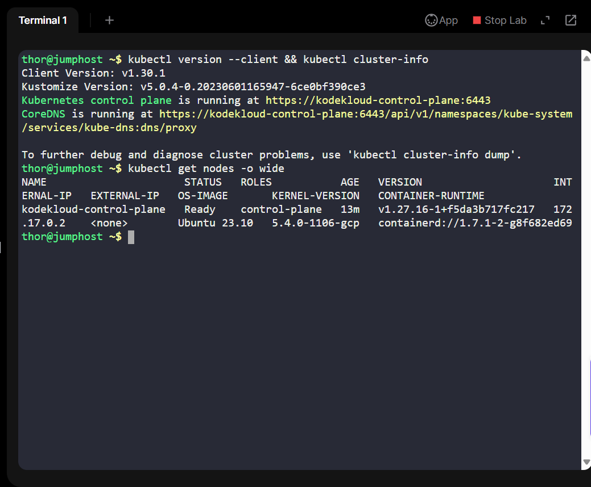
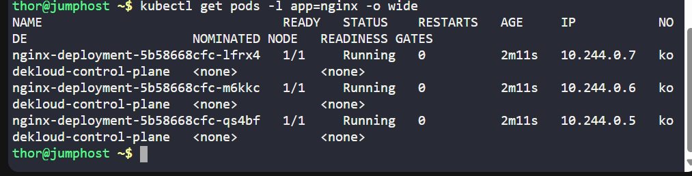
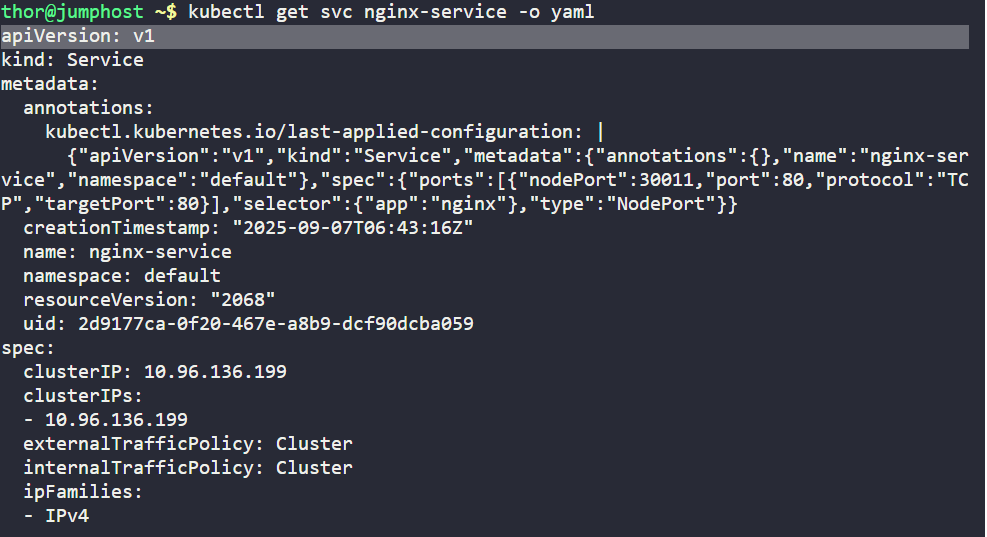
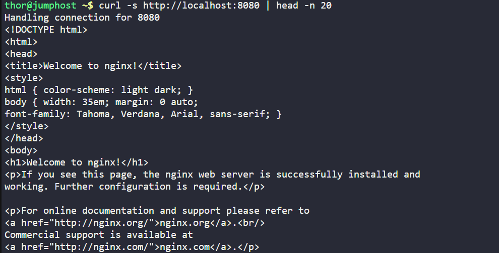

# Day 32 - Deploying a Highly Available Static Website on Kubernetes

As part of my 100 Days of Cloud/DevOps challenge, I continued hands-on Kubernetes practice in the KodeKloud labs.

The goal of this project was to deploy a highly available and scalable static website using nginx on Kubernetes, demonstrating the use of Deployments and NodePort Services.

## Business Context
In real-world scenarios, companies need their websites and applications to be:

-Highly available{ so users can always access them.

-Scalable: so the service can handle more traffic by adding replicas.

-Easily accessible: exposed through stable endpoints.

By containerising a static website using nginx and deploying it with 3 replicas behind a NodePort service, we simulate how modern businesses ensure that their customer-facing platforms remain reliable and accessible.

## What I Did
Step 1 - Checked Cluster Setup and Permissions

Before creating resources, I verified:

-Cluster info (kubectl cluster-info)

-Node status (kubectl get nodes -o wide)

-My RBAC permissions to create deployments and services (kubectl auth can-i ...).

Step 2 - Created Deployment (nginx-deployment.yaml)
I defined a Kubernetes Deployment that:

•	Runs the nginx:latest image.

•	Names the container nginx-container.

•	Ensures 3 replicas for high availability.

Step 3 - Created NodePort Service (nginx-service.yaml)
I exposed the deployment using a NodePort service so it could be accessed from outside the cluster.

The service listens on port 80 and exposes it on nodePort 30011.

Step 4 - Verified Access to the Website

•	First, I tried reaching the service directly via the node IP and port (172.17.0.2:30011), which is the normal method in Kubernetes.

•	Since direct access didn’t work in this lab environment (restricted networking), I used kubectl port-forward to map service port 80 to localhost:8080.

•	Accessed the site successfully with curl http://localhost:8080, which returned the nginx welcome page.

## Key Learnings and Business Value
-Deployments provide self-healing and scalability by maintaining a desired replica count.
-Services (NodePort in this case) ensure stable access to applications.
-This exercise simulates how enterprises keep their customer websites always available, regardless of traffic or node failures.
-Practicing these tasks demonstrates my ability to design, implement, and troubleshoot Kubernetes workloads in real-world environments.

## Reflection
1. This project reinforced my understanding of high availability and scalability in Kubernetes.
2. It showed me how businesses ensure minimal downtime, which is critical for customer trust and satisfaction.
3. This was a valuable step forward in my 100 Days of Cloud/DevOps journey, and it builds directly on my earlier days working with Docker, Kubernetes pods, and cluster basics.
