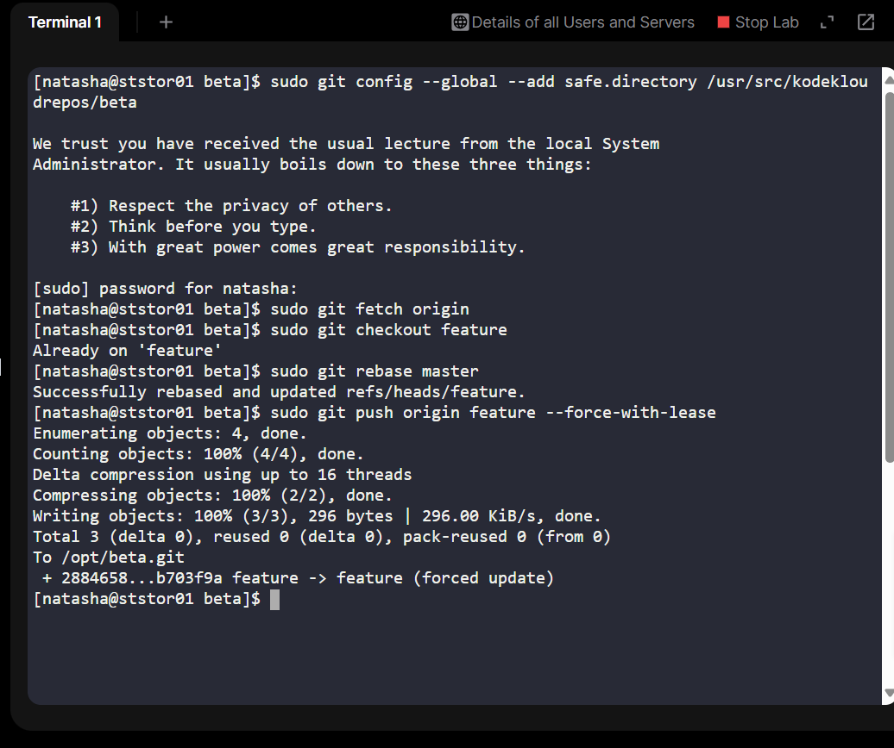
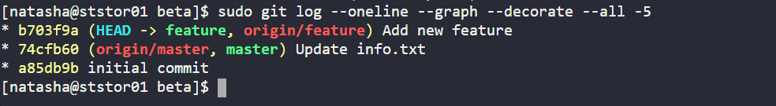

On Day 32 I performed a safe rebase of a long-running `feature` branch onto the current `master` without creating merge commits, and pushed the rebased branch back to the bare repo. This preserves a clean, linear commit history while keeping the feature work intact, an important task in CI/CD pipelines and release workflows.

## Business need & value
-**Why rebase?** A clean, linear history makes audits, rollbacks, and bisects easier. It avoids merge commit noise and preserves the feature work so reviewers and CI pipelines can evaluate the code in the context of the latest `master`.

-**Business impact:** Faster code review cycles, easier regression detection, fewer conflicts during release merges, and clearer release notes.

## The challenge I encountered
In this lab environment, the working repository and bare repository were owned by `root`, which caused repeated push failures despite correct local rebases. The automated grader checks the repository under `/usr/src/kodekloudrepos` and needs to see the rebased branch on the remote bare repo. The fix required using `sudo` for safe.directory and the git operations (or changing ownership) so Git could write temporary objects and update refs.

This subtle permission detail cost me several retries and was a great real-world reminder: **always check repository ownership and permissions when pushing or running server-side Git operations.**

## Steps I ran (execute on the storage server `ststor01`)
Note: Run `ssh natasha@ststor01`, then operate on `ststor01`.

1. Ensure you are in the repo the grader checks:

cd /usr/src/kodekloudrepos/beta

sudo git config --global --add safe.directory /usr/src/kodekloudrepos/beta

sudo git config --global --add safe.directory /opt/beta.git

sudo git fetch origin

sudo git checkout feature

sudo git rebase origin/master

sudo git push origin feature --force-with-lease

Verify:

git log --oneline --graph --decorate -n 10

cat info.txt

## Lessons learned

Lab environments can (and do) run repos as root; if a push or rebase fails with unpack/unpackper errors, check permissions immediately.

Keep rebase workflow minimal: fetch → reset --hard origin/feature → rebase origin/master → push --force-with-lease. No extra commits unless a conflict requires a real content change.

## Why this is relevant to employers
This task demonstrates:

Practical Git skills at scale (server-side repos and bare remotes).

Troubleshooting ownership/permissions issues — a common real-world ops problem.

Discipline in maintaining linear history (important for release engineering).

Ability to communicate steps clearly and provide evidence (screenshots + logs).
