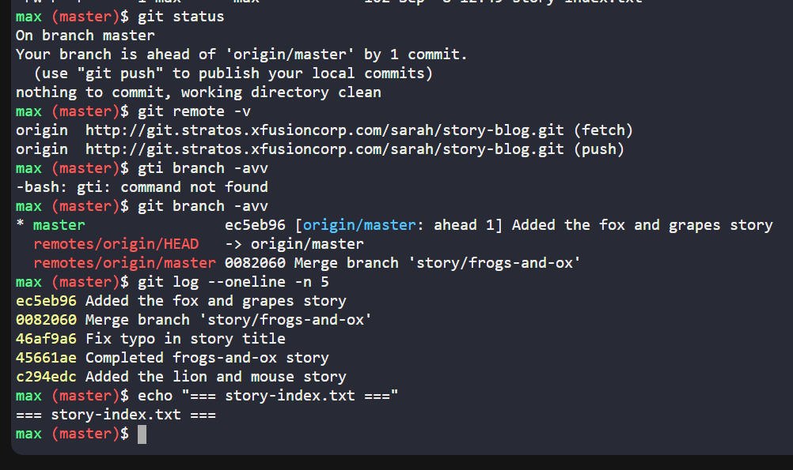
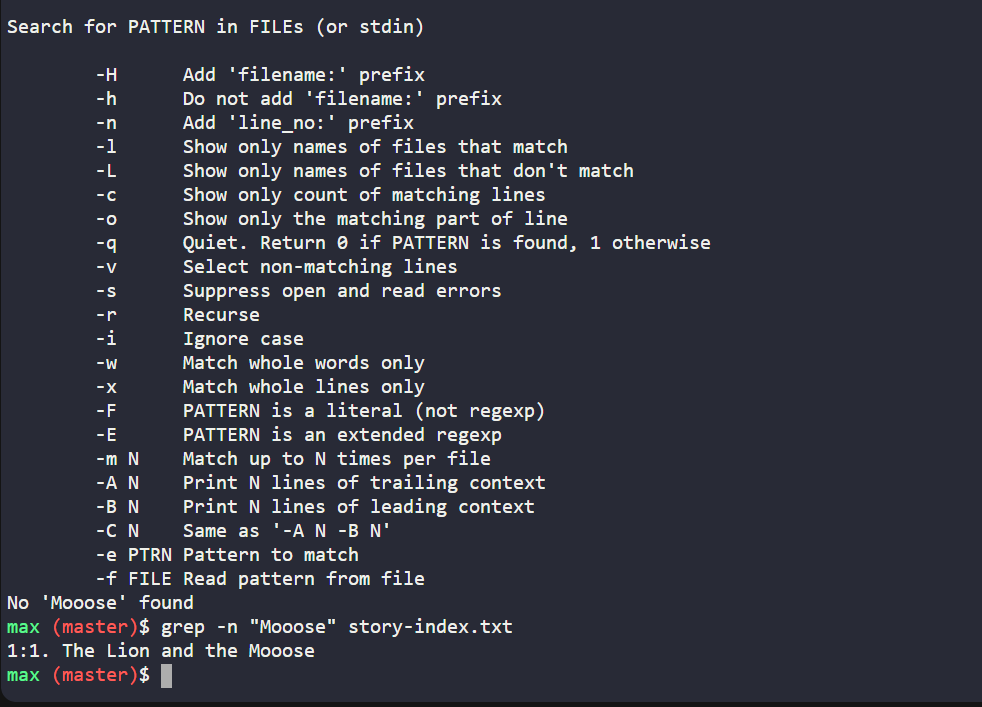
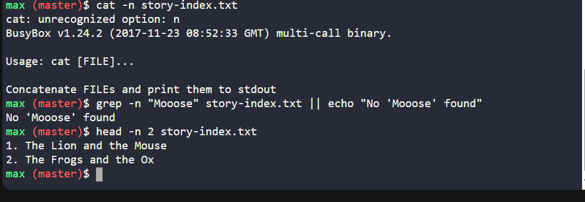
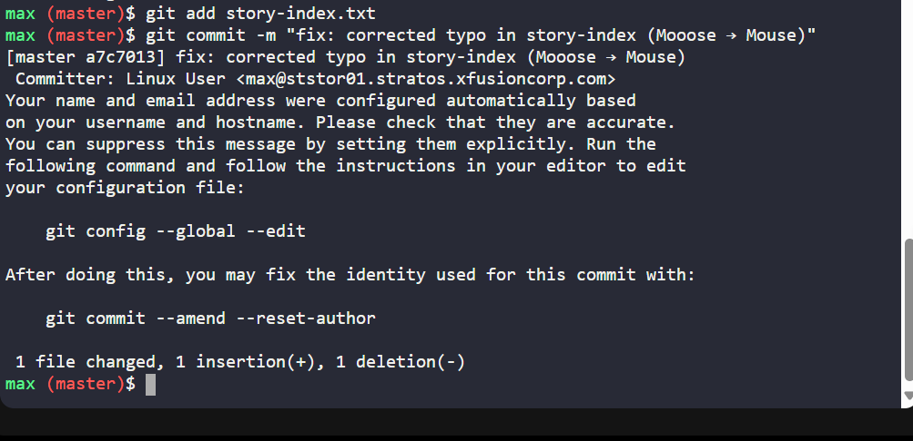
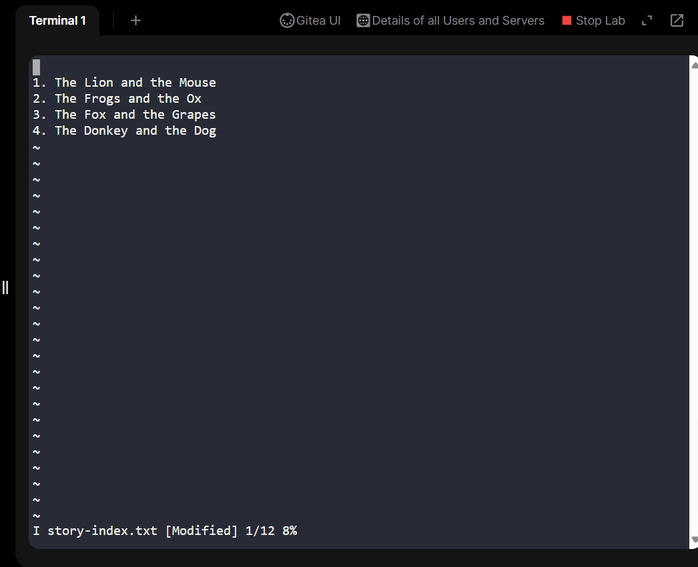
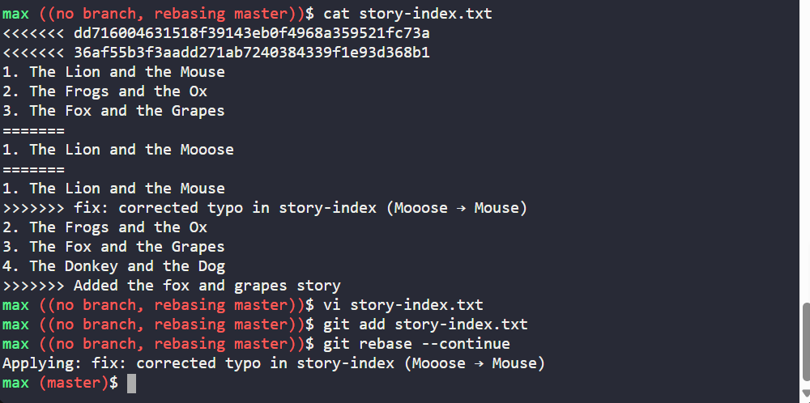
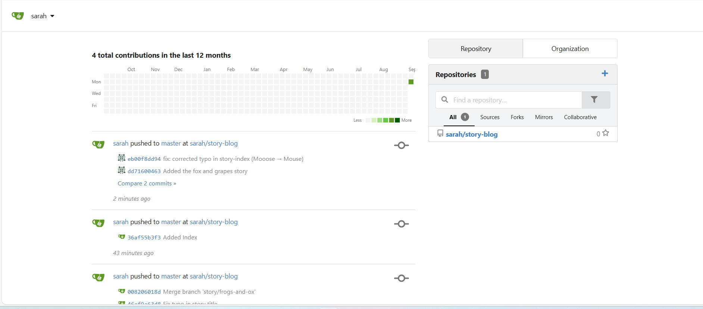

# Day 33: Story-Blog Repository - Git Rebase and Fixing Collaboration Issues
## Overview
On Day 33 of my 100 Days of DevOps journey, I worked on the Story-Blog project, a collaborative repository maintained by two developers, Sarah and Max. This task focused on managing commits, resolving conflicts, correcting typos, and ensuring a linear Git history through rebase, while also addressing permission and push issues encountered during remote updates.

Repository location on storage server: /home/max/story-blog

Remote origin: http://git.stratos.xfusioncorp.com/sarah/story-blog.git

## Business Needs
-Maintain a clean and linear Git history in a shared repository to reduce merge conflicts and improve traceability.

-Ensure all story titles are accurate and complete for end-user readability.

-Support team collaboration by allowing multiple developers to work on features without losing data.

-Demonstrate real-world DevOps workflow, including SSH access, permissions management, rebasing, and conflict resolution.

## Step-by-Step Workflow
### Step 1: SSH to the Storage Server

ssh max@ststor01

Password: Max_pass123

cd /home/max/story-blog

### Step 2: Inspect the Repository

git status

git remote -v

git log --oneline -n 5

-Verified that Max's branch was ahead by 1 commit.

### Step 3: Check for Typos in story-index.txt

grep -n "Mooose" story-index.txt || echo "No 'Mooose' found"

-Found typo in "The Lion and the Mooose".

### Step 4: Correct the Typo

sed -i 's/Mooose/Mouse/' story-index.txt

head -n 4 story-index.txt

-Ensured all four stories are correctly listed.

### Step 5: Commit Changes
git add story-index.txt

git commit -m "fix: corrected typo in story-index (Mooose → Mouse)"

-Committed changes locally with a clear message.

### Step 6: Handle Remote Push Conflicts
git fetch origin

git rebase origin/master

### Resolved conflicts when prompted
git add story-index.txt

git rebase --continue

-Encountered merge conflicts due to simultaneous changes by Sarah.

-Resolved conflicts by editing story-index.txt and keeping all 4 stories.

Step 7: Push Changes to Remote

git push origin master

**If rejected due to remote changes, perform rebase then push**

git push origin master

-Successfully updated the remote repository.

### Step 8: Validate Changes
cat story-index.txt

head -n 1 *.txt

-Verified all titles and content were correct and present.

## Benefits and Lessons Learned
-Learned how rebase maintains a clean Git history while integrating upstream changes.

-Understood permission management and when to use sudo in storage server workflows.

-Gained experience in resolving merge conflicts, which is a common scenario in multi-developer environments.

-Ensured business continuity: story-blog content was accurate, complete, and synchronized with the repository.

## Summary
This task demonstrates practical Git operations, conflict resolution, and the importance of correct permissions and workflow discipline in real-world DevOps environments. It reinforces the need for careful collaboration in shared repositories while ensuring business requirements are fully met.
