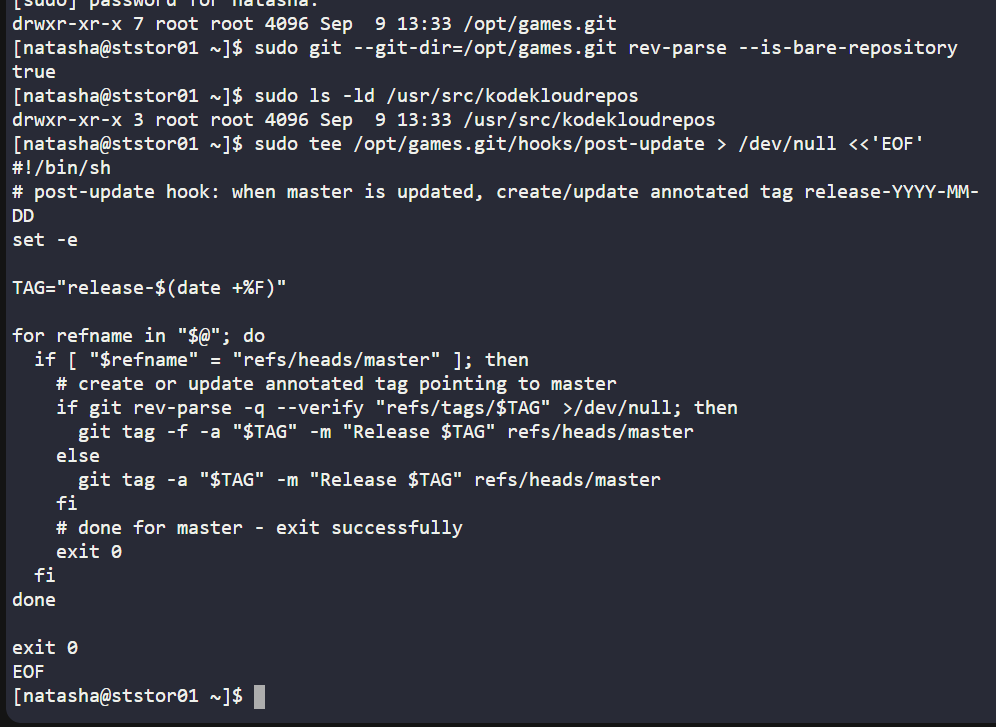
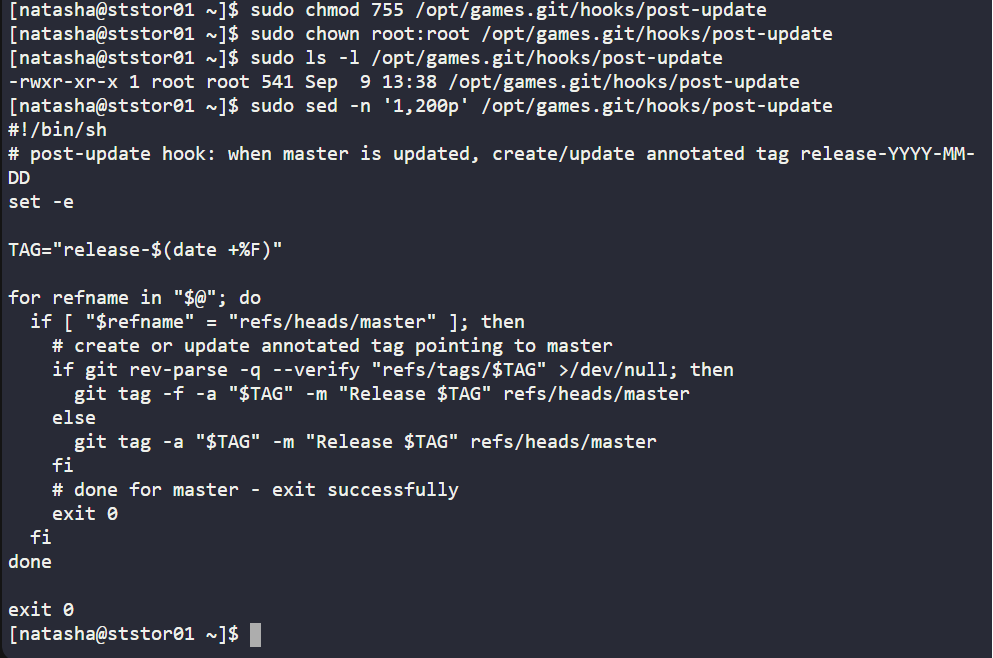
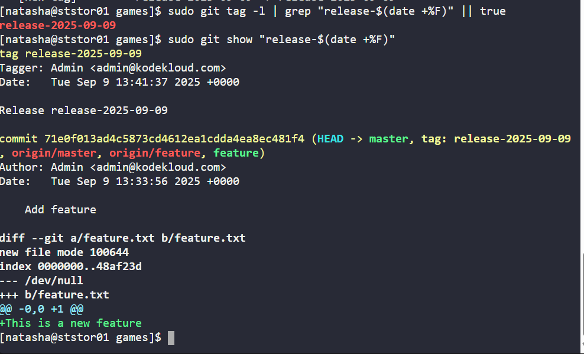

# 100 Days of DevOps - Day 34: Automating Release Tagging with Git Hooks

## Project Overview
On Day 34 of my 100 Days of DevOps journey, I worked on automating release tagging in a Git repository using server-side hooks. The task involved:

-Setting up a post-update hook in a bare Git repository on a storage server.

-Ensuring that every time the master branch is updated, a release tag is automatically created using the current date.

-Merging a feature branch into master and validating the automation.

This exercise simulates a real-world DevOps workflow where teams need automated versioning and release management, crucial for continuous delivery pipelines and ensuring traceability of deployments.

## Business Value
•	Automated Release Management: Reduces manual errors in tagging releases and ensures that each master update is properly versioned.

•	Traceability: Tags correspond to actual release dates, helping operations and QA teams track production-ready changes.

•	CI/CD Ready: Tagged releases can be directly used in pipelines for deployment or rollback purposes.

•	Team Collaboration: Helps multiple developers maintain consistent versioning in a shared repository.

## Project Steps & Explanation
1. Access the Storage Server

ssh natasha@ststor01

Purpose: Connect to the server hosting the bare Git repository to create server-side hooks.

2. Navigate to the Bare Repository Hooks Directory

cd /opt/cluster.git/hooks

Purpose: Git hooks reside in the hooks/ folder of the bare repository.

3. Create the Post-Update Hook

The post-update hook automatically tags master after any push:

Purpose:

-Detects updates to master (refs/heads/master)

-Creates a release tag using today's date if it doesn’t exist

4. Make the Hook Executable

sudo chmod +x /opt/cluster.git/hooks/post-update

sudo ls -l /opt/cluster.git/hooks/post-update

Purpose: Ensure Git can execute the hook on server-side pushes.

5. Merge Feature Branch into Master

cd /usr/src/kodekloudrepos/cluster

sudo git checkout master

sudo git pull origin master

sudo git merge --no-ff feature -m "Merge feature into master"

Purpose: Ensure the master branch is updated so the hook can be triggered.

6. Push Master to Trigger Hook

sudo git push origin master

Outcome:

remote: Creating release tag for 2025-09-09...

remote: Tag release-2025-09-09 created.

Purpose: Triggers the post-update hook to create the release tag.

7. Verify Tag Creation

sudo git --git-dir=/opt/cluster.git tag -l

sudo git --git-dir=/opt/cluster.git show release-$(date +%F)

Outcome: The tag exists and points to the latest commit in master.

## Benefits Highlight

•	Automation: No manual tagging needed, reduces human errors.

•	Business Continuity: Each release can be traced to a commit and date.

•	Team Collaboration: Ensures all developers work with consistent release versions.

•	CI/CD Ready: Tags can trigger downstream deployment pipelines.
