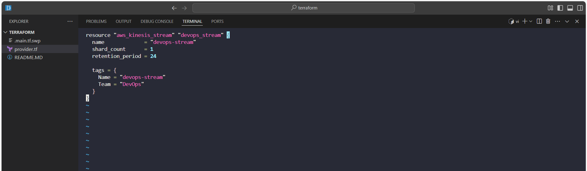
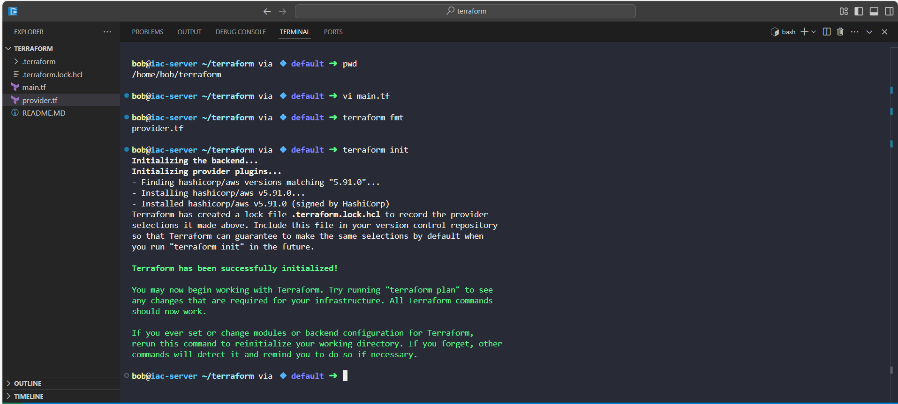
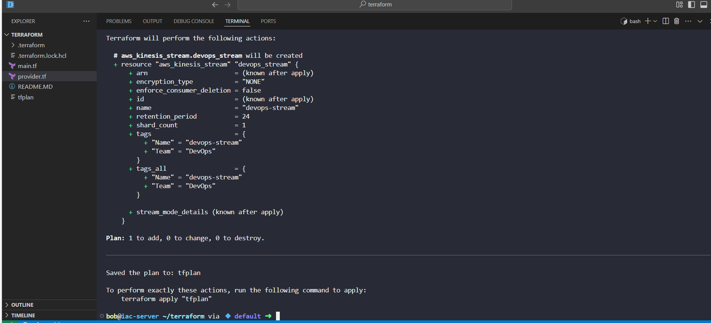
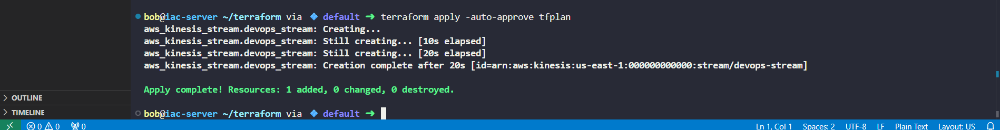
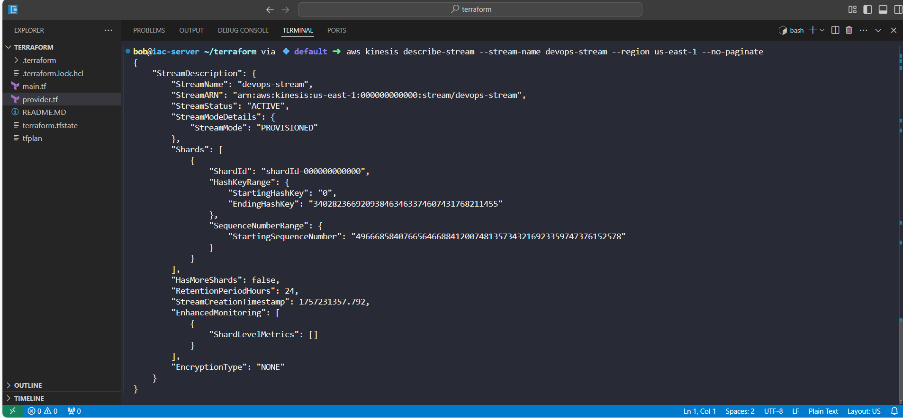
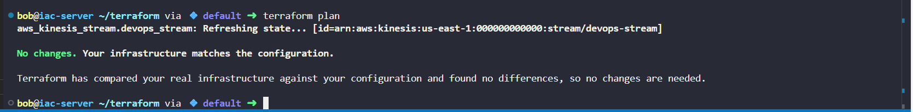

# Day 34: Creating AWS Kinesis Stream with Terraform
Today’s challenge was to deploy an AWS Kinesis Data Stream named devops-stream using Terraform, following best practices for IaC.

This stream is critical for real-time data ingestion, which can then be consumed by downstream applications for analytics, monitoring, and operational insights.

## Business Need & Essence
Modern applications need real-time data processing for tasks such as:

•	Streaming logs or telemetry data for monitoring and alerting

•	Analytics on live data for business intelligence

•	Triggering workflows based on events in near real-time

By using Terraform to provision Kinesis streams:

•	Infrastructure is declarative and reproducible

•	Configurations can be version-controlled

•	Teams can avoid manual AWS console operations, reducing errors and ensuring consistency

## Step-by-Step Implementation

Server: iac-server (Terraform working directory /home/bob/terraform)

Step 1: Create main.tf

Step 2: Format & Validate Terraform

terraform fmt: formats main.tf

terraform validate: checks syntax & configuration correctness

Step 3: Initialise Terraform

terraform init

•	Downloads provider plugins

•	Prepares working directory

Step 4: Plan the deployment

terraform plan -out=tfplan

•	Shows what resources will be created

•	Saves the plan as tfplan

Step 5: Apply the Terraform plan

terraform apply -auto-approve tfplan

•	Creates the Kinesis stream in AWS

Step 6: Verify the deployment

terraform plan    # should show: No changes. Your infrastructure matches the configuration.

aws kinesis describe-stream --stream-name devops-stream --region us-east-1 --no-paginate

•	Confirms the stream exists and is ACTIVE

Step 7: Reapply if tags were missing
•	Sometimes the second terraform plan shows 1 update in-place due to tags

•	Run:

terraform apply -auto-approve

terraform plan

## Key Learnings & Benefits
•	Practiced Terraform workflow: init → validate → plan → apply → verify

•	Learned to manage AWS Kinesis streams declaratively

•	Understood tagging and resource drift detection

•	Reinforced IaC best practices: version control, reproducibility, and minimal manual intervention

## Business value:

•	Reduces operational errors in real-time data pipelines

•	Enables scalable and reliable streaming data architecture

•	Supports downstream analytics and near-real-time decision-making
