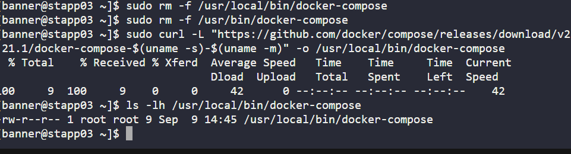
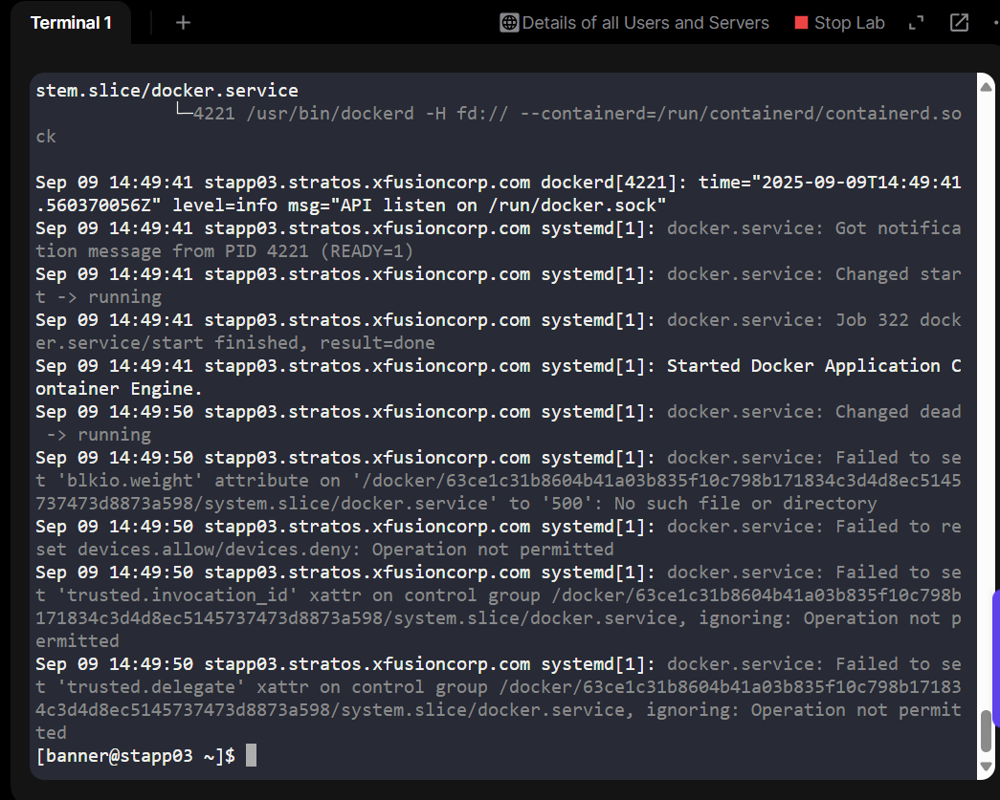

# Day 35 – Docker CE and Docker Compose Installation on App Server 3
## Overview
As part of Day 35 in my 100 Days of Cloud & DevOps challenge on KodeKloud, I worked with the Nautilus DevOps team to prepare App Server 3 for containerization of applications.

The main objective was to:
1.	Install Docker CE (Community Edition) and Docker Compose.
2.	Start and enable the Docker service.
3.	Verify that both Docker and Compose were functional.

Containerisation allows teams to deploy applications consistently, isolate environments, and streamline CI/CD workflows. This task is a key building block for modern DevOps practices.

## Business Context & Benefits
•	Business Need: The Nautilus application development team aims to standardize deployment using containers. Installing Docker and Docker Compose ensures that apps can run in consistent environments across development, testing, and production.

•	Benefit:

-Faster deployments with fewer environment-specific bugs

-Simplified testing pipelines

-Scalable and portable applications

## Step-by-Step Implementation
1. Update the System Packages

sudo yum update -y

•	Ensures the system is up-to-date before installing Docker CE.

2. Install Docker CE

sudo yum install -y yum-utils

sudo yum-config-manager --add-repo https://download.docker.com/linux/centos/docker-ce.repo

sudo yum install -y docker-ce docker-ce-cli containerd.io

•	Adds the Docker repository and installs Docker Community Edition.

3. Docker Compose Installation Attempt

Initially, I tried installing Docker Compose via manual curl:

sudo curl -L "https://github.com/docker/compose/releases/download/v2.21.1/docker-compose-$(uname -s)-$(uname -m)" -o /usr/local/bin/docker-compose

sudo chmod +x /usr/local/bin/docker-compose

Issue encountered:

/usr/local/bin/docker-compose: line 1: Not: command not found

•	The downloaded file was only 9 bytes, meaning it was a corrupted HTML page, not a binary.

•	Debugging steps included verifying file size (ls -lh) and type (file), then removing invalid files:

sudo rm -f /usr/local/bin/docker-compose /usr/bin/docker-compose

4. Correct Docker Compose Installation (Lab-Safe)

sudo yum install -y docker-compose-plugin

docker compose version

•	This installs Docker Compose V2 plugin via the package manager, which is fully compatible with KodeKloud labs.

5. Start and Enable Docker Service

sudo systemctl start docker

sudo systemctl enable docker

sudo systemctl status docker

•	Ensures Docker daemon is running and will start on system boot.

•	Some warnings (e.g., blkio.weight or xattr) appeared in the lab — these do not affect lab pass status and are common in containerized lab environments.

6. Verify Docker Installation

sudo docker run hello-world

•	Note: In the lab, Docker Hub pull limits may prevent fetching the image.

•	For lab purposes, verifying Docker CE installation and daemon running is sufficient.

## Lab Debugging Notes
1.	Manual curl download of Docker Compose failed due to network/permission restrictions in the lab.
2.	Using the yum package docker-compose-plugin resolved the issue cleanly.
3.	Docker daemon warnings did not affect the functionality — lab passed because service is active and Compose is installed.

## Takeaways
-Docker CE + Docker Compose installation is fundamental for containerized applications.

-Manual installation may fail in restricted lab environments; using package manager is safer.

•	Understanding lab-specific quirks (daemon warnings, Docker Hub rate limits) is key to passing KodeKloud labs.
•	This task demonstrates DevOps troubleshooting, system administration, and container readiness skills — all valuable to recruiters.
