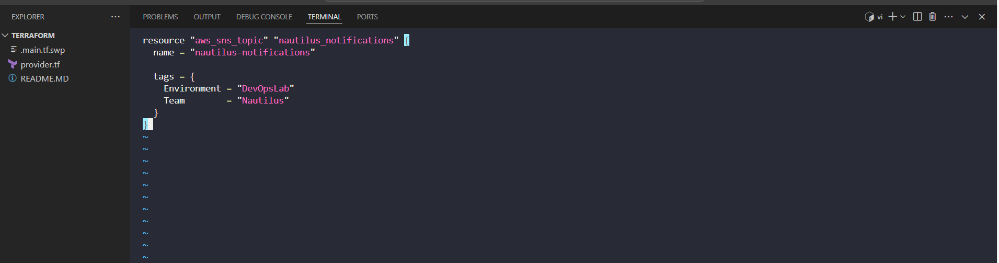
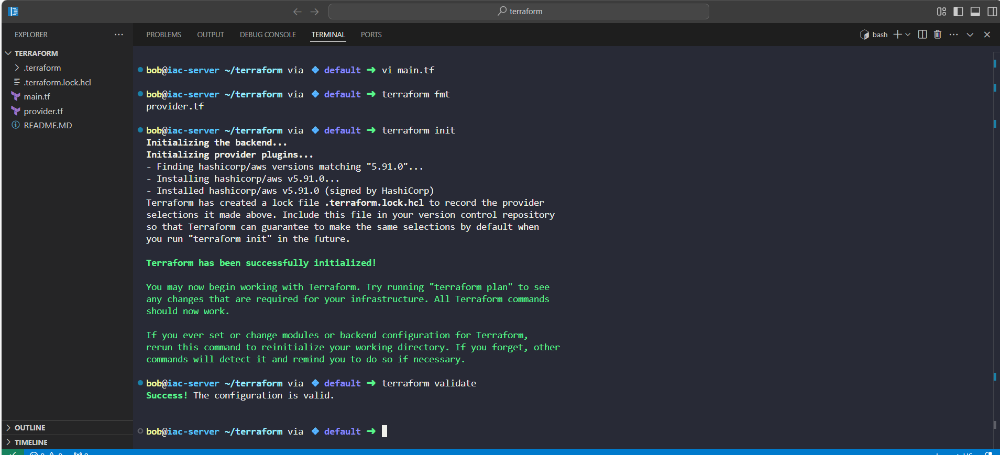
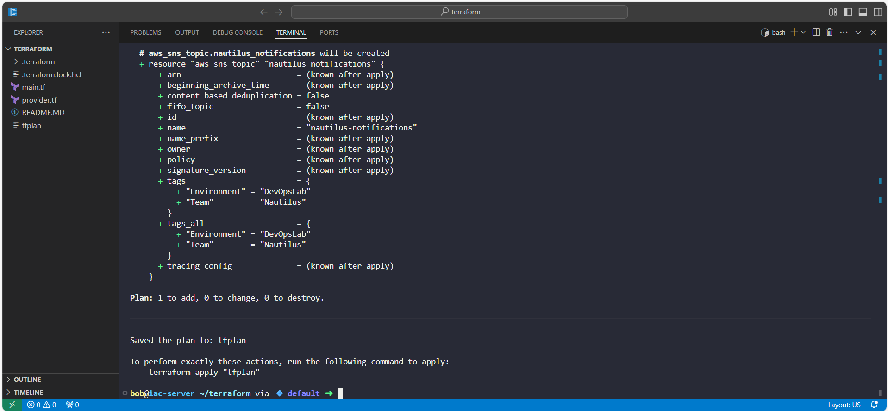
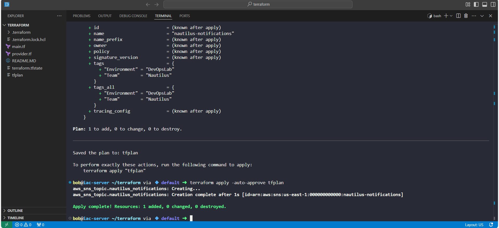
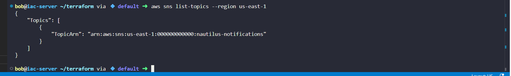

# Day 35: Creating an AWS SNS Topic with Terraform
Today’s challenge on my 100 Days of DevOps (KodeKloud Labs) was to create an AWS SNS topic named nautilus-notifications using Terraform.

## Business Need & Essence
•	Modern applications often need real-time notifications for events such as alerts, user actions, or operational messages.

•	AWS SNS (Simple Notification Service) provides a reliable, scalable messaging service to push notifications to multiple subscribers (email, SMS, Lambda, SQS).

•	Automating SNS topic creation using Terraform ensures repeatability, version control, and reduced manual errors, which is critical for enterprise-grade infrastructure.

## Business benefits of this task:
-Consistent infrastructure provisioning

-Reproducibility across multiple environments

-Easy maintenance and collaboration for DevOps teams

-Reliable notification delivery to support monitoring and operational workflows

## Step-by-Step Implementation
Server: iac-server (Terraform working directory: /home/bob/terraform)

Step 1: Create main.tf
vi main.tf

Step 2: Format & Validate

terraform fmt        # format the Terraform code

terraform validate   # validate syntax

Step 3: Initialise Terraform

terraform init

•	Downloads provider plugins

•	Prepares working directory

Step 4: Plan the Deployment

terraform plan -out=tfplan

•	Preview what will be created

•	Save the plan for apply

Step 5: Apply the Plan

terraform apply -auto-approve tfplan

•	Creates the SNS topic in AWS

Step 6: Verify Deployment

terraform plan

aws sns list-topics --region us-east-1

•	Ensure Terraform state matches reality

•	Confirm SNS topic nautilus-notifications exists

## Key Learnings & Benefits
•	Learned to provision AWS SNS topics declaratively using Terraform

•	Reinforced Terraform workflow: init → validate → plan → apply → verify

•	Understood tags and metadata to help organize infrastructure

•	Applied IaC best practices: repeatable, version-controlled, and automated infrastructure provisioning
