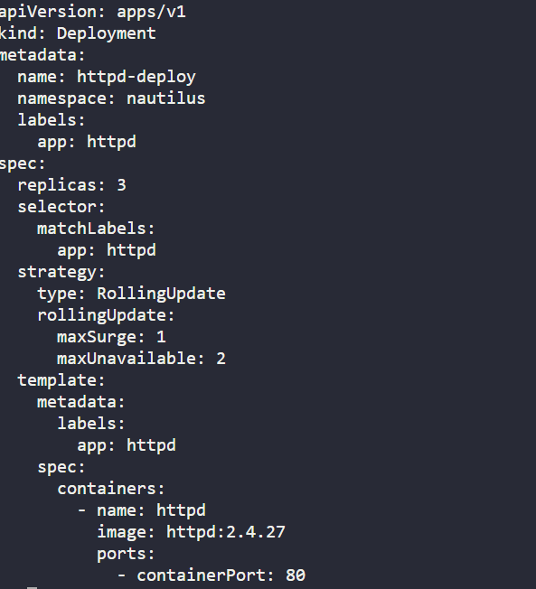
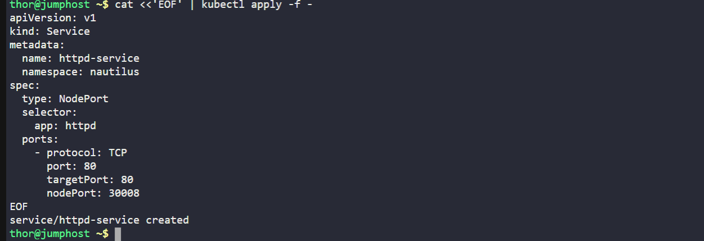
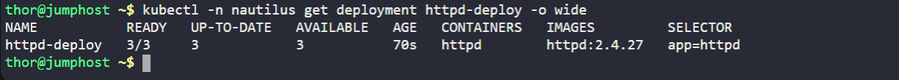
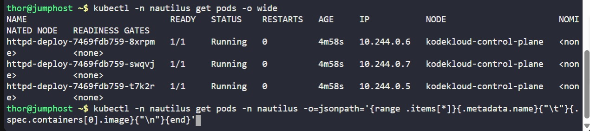
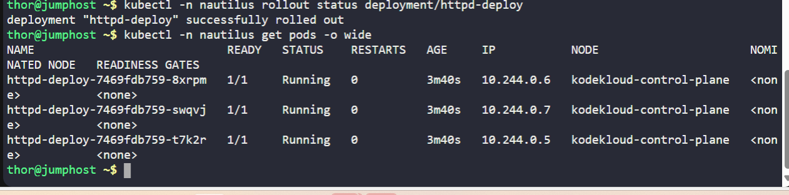
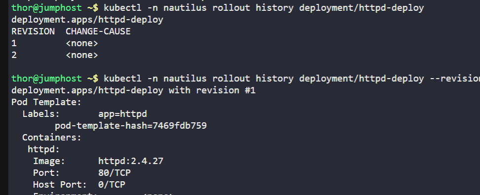
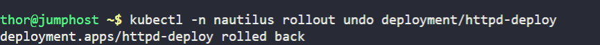
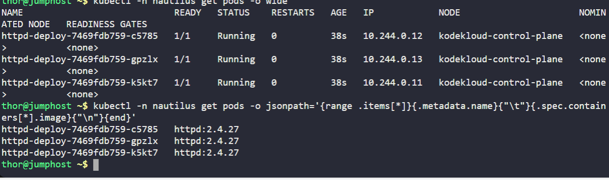
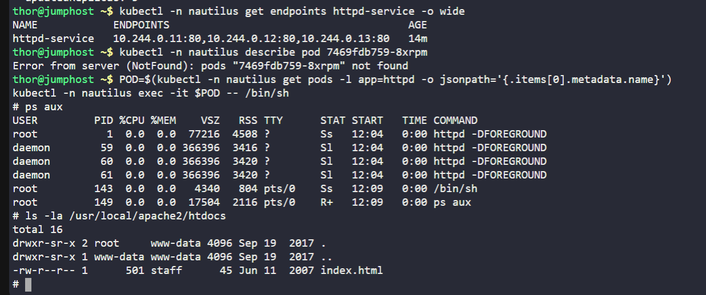

# Day 35 - Kubernetes Rolling Update & Rollback (KodeKloud / 100 Days of DevOps)

As part of my **100 Days of DevOps journey**, today I focused on testing **deployment updates and rollbacks** in a Kubernetes environment. This lab simulated a real-world production scenario where DevOps teams must validate new versions before release and be able to roll back safely if issues arise.

## Business Need
In production systems, downtime is costly. Businesses demand:

-**High availability** — updates must not take the entire service offline.

-**Controlled risk** — new images should roll out gradually.

-**Quick recovery** — rollback mechanisms must restore service if an upgrade fails.

This exercise helps address those needs by practicing **rolling updates with rollback** on a deployment running Apache HTTPD.

## What I Did
1. **Created a namespace (`nautilus`)** to logically isolate the deployment.  

kubectl create namespace nautilus

kubectl get ns nautilus

2. **Deployed `httpd-deploy` with 3 replicas (image: `httpd:2.4.27`)** using the `RollingUpdate` strategy (`maxSurge=1`, `maxUnavailable=2`).  

3. **Exposed the deployment via a NodePort service (`httpd-service`) on port `30008`.**  
   

3. **Verified the initial rollout** — pods running `httpd:2.4.27`.  

4. **Upgraded the deployment to `httpd:2.4.43`** with a rolling update.  
  

5. **Confirmed new pods are running the upgraded version.**  
   

6. **Checked rollout history** (revisions 1 and 2).  

7. **Performed a rollback** to the previous version (`httpd:2.4.27`).  

8. **Verified pods reverted to the original version.**  

9. **Exec’d into a pod** to inspect running processes and web content, then cleanly exited.  
    

## Key Takeaways
-Practiced safe **rolling upgrade** with controlled availability.

-Learned how to **inspect rollout history** to trace versions.

-Validated **rollback workflows** that restore services quickly.

-Reinforced the importance of **namespace isolation** for deployments.
