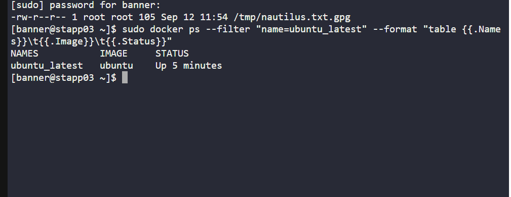
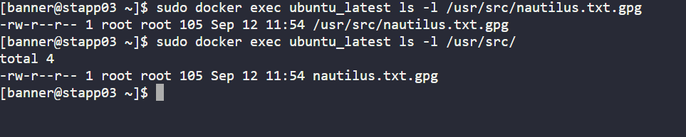
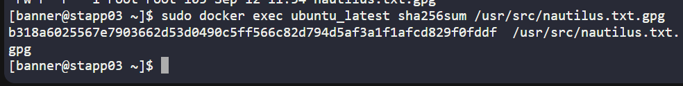
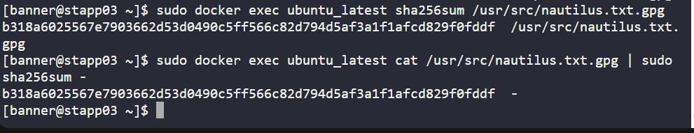

# Day 37 - Secure File Transfer into a Running Container (KodeKloud Lab)
As part of my 100 Days of DevOps journey on KodeKloud, today’s challenge focused on secure data handling: copying an encrypted file from the host system into a running Docker container without modifying its contents.

## Business Context & Essence
Organisations often need to move sensitive or confidential data into isolated application environments for further processing or deployment.

The key business requirements here are:

-Data integrity → The file must remain unchanged during transfer.

-Security assurance → Confidential data should never be tampered with or exposed.

-Operational precision → Engineers must verify and document the steps to prove compliance.

This task mirrors real-world DevOps scenarios where data pipelines, encrypted secrets, or config files must be reliably moved into containers that form the backbone of production applications.

## Steps I Performed (on App Server 3, CentOS host)
1. Verified the Source File Exists on the Host:

I confirmed the encrypted file /tmp/nautilus.txt.gpg was present on the host with correct size and permissions.

2️. Confirmed the Container Was Running

Checked that the target container ubuntu_latest was up and available.

3️. Computed a Baseline Hash of the File

On the host, I calculated a SHA-256 checksum of the encrypted file to establish its original fingerprint.

4️. Copied File into Container Using docker cp

I securely copied the file into /usr/src/ inside ubuntu_latest.

5️. Verified File Inside Container

Listed the target directory in the container to ensure the file appeared at the expected location.

6️. Validated Integrity with Container Hash

Ran a checksum inside the container and compared with the host hash, both matched exactly, confirming the file was not modified during transfer.

## Key Learnings & Benefits
1. Gained hands-on practice with Docker’s file operations (docker cp).
2. Strengthened knowledge of data integrity verification using cryptographic hashes.
3. Reinforced security best practices: never decrypt or expose confidential files, only validate transfer integrity.
4. Understood the business impact: proving secure, unchanged delivery of sensitive data is critical for regulatory compliance and operational trust.
