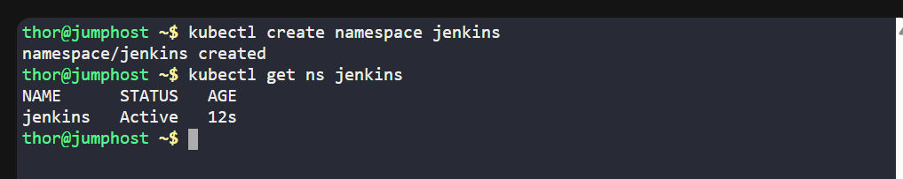
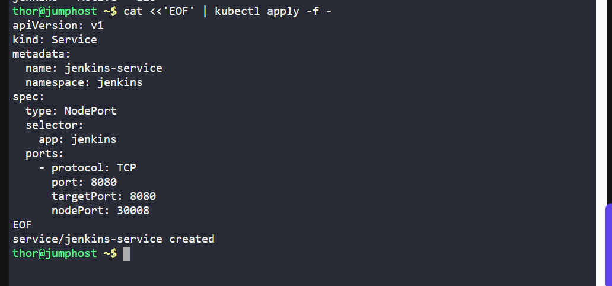
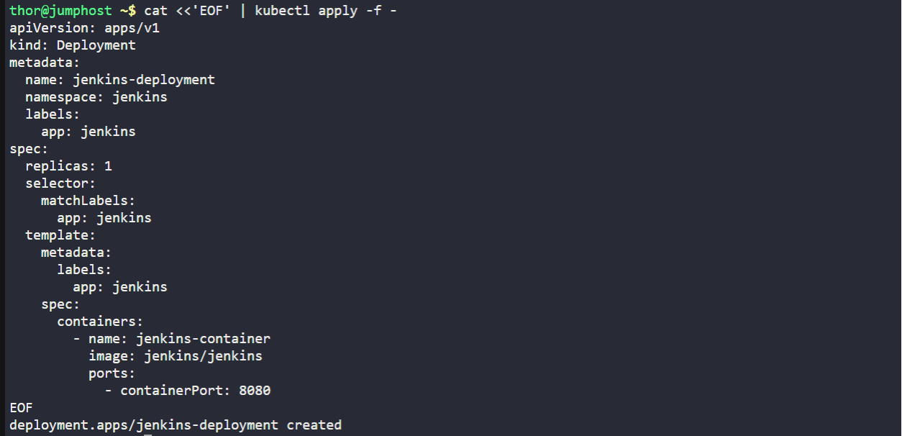
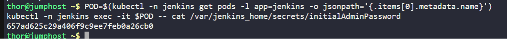
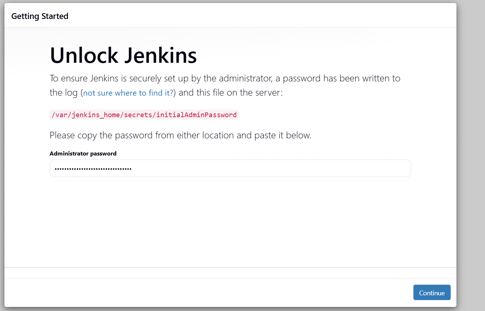

# Overview
As part of my 100 Days of Cloud & DevOps journey, Day 35 focused on deploying Jenkins on a Kubernetes cluster. This project simulates a real-world scenario where a DevOps team needs a CI/CD automation server to manage deployments for multiple projects.

## Business Value:
-Automates build and deployment pipelines.

-Reduces human error and manual intervention.

-Increases deployment speed and consistency.

-Enables scalable CI/CD in a cloud-native environment.

## Technical Summary:
-Deployed Jenkins in its own namespace (jenkins) to ensure isolation.

-Exposed Jenkins via a NodePort Service for browser access.

-Used a single-replica deployment for simplicity in a lab scenario.

-Verified the pod and service connectivity before accessing the Jenkins UI.
Screenshot suggestion: day35-architecture.png – show Jenkins pod, service, and NodePort flow diagram.

## Steps & Implementation
1. Create a Namespace

kubectl create namespace jenkins

kubectl get ns

Purpose:

•	Namespaces provide logical separation for resources.

•	Supports multiple environments/projects in the same cluster.

2. Create the Jenkins Service

**jenkins-service.yaml**

kubectl apply -f jenkins-service.yaml

kubectl -n jenkins get svc

kubectl -n jenkins describe svc jenkins-service

Purpose & Business Context:

•	Exposes Jenkins to the cluster and externally via NodePort.

•	Enables developers and CI/CD pipelines to access Jenkins securely.

3. Create the Jenkins Deployment
**jenkins-deployment.yaml**

**Purpose & Business Context:**

-Runs Jenkins as a containerized app, ensuring portability and consistent environments.

-Using replicas: 1 simplifies lab verification while demonstrating deployment strategies.

-Rolling updates strategy ensures minimal downtime for future scaling.

4. Verify Jenkins Pod & Logs

POD=$(kubectl -n jenkins get pods -l app=jenkins -o jsonpath='{.items[0].metadata.name}')

kubectl -n jenkins logs -f $POD

kubectl -n jenkins exec -it $POD -- cat /var/jenkins_home/secrets/initialAdminPassword

Purpose:

-Ensures container is running correctly.

-Retrieves the initial admin password for Jenkins login.

5. Access Jenkins UI

NODE_IP=$(kubectl get nodes -o wide | awk 'NR==2{print $6}')

**Open in browser:**
http://$NODE_IP:30008

Outcome:

•	Jenkins login screen is accessible externally.

•	Admin password retrieved in step 4 allows initial setup.

kubectl apply -f jenkins-deployment.yaml

kubectl -n jenkins get deployment

kubectl -n jenkins rollout status deployment/jenkins-deployment

kubectl -n jenkins get pods -o wide

## Key Learnings & Benefits
1.	Kubernetes Namespaces enable environment separation.
2.	NodePort Services make internal pods accessible externally for DevOps workflows.
3.	Containerized Jenkins allows portable, reproducible CI/CD environments.
4.	Rolling Deployments & Logs provide insight into Kubernetes application health.
5.	Real-world DevOps scenario: provisioning CI/CD tools in a secure, scalable, cloud-native manner.
