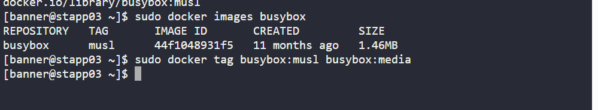
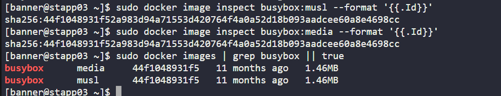

# Day 38: Container Image Retagging with BusyBox (KodeKloud Lab)

As part of my **100 Days of DevOps journey**, I worked on container image management basics.  

On **Day 38**, the task was to **pull an existing container image (`busybox:musl`) and re-tag it as `busybox:media`** on **App Server 3** in the Nautilus Project environment.  

## Business Context

For developers testing features in containerised environments, having the **right image tags** is essential:  

- **Reproducibility**: Teams can use the same tag across dev, QA, and prod.  

- **Traceability**: Custom tags (e.g., `media`) help identify the purpose of an image.  

- **Deployment readiness**: Avoids ambiguity during rollouts in CI/CD pipelines.  

This exercise ensured images are consistently named and traceable, these are critical for large-scale deployments.

## Key Steps & Commands

1. **Logged into App Server 3 and verified container runtime**

ssh tony@stapp01

sudo docker --version || echo "docker not found"

2. Pulled the busybox:musl image

sudo docker pull busybox:musl

3. Verified the image was pulled

sudo docker images busybox

4. Tagged the image as busybox:media

sudo docker tag busybox:musl busybox:media

5. Confirmed both tags exist and point to the same image ID

sudo docker images busybox

sudo docker image inspect busybox:musl --format '{{.Id}}'

sudo docker image inspect busybox:media --format '{{.Id}}'

6. sudo docker images | grep busybox || true

## Benefits of the Task
Consistency: Human-readable tags simplify image promotion through pipelines.

Reliability: Ensures environments use the same container definition.

Scalability: Critical for CI/CD automation at scale.
