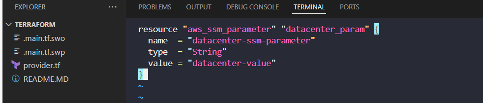
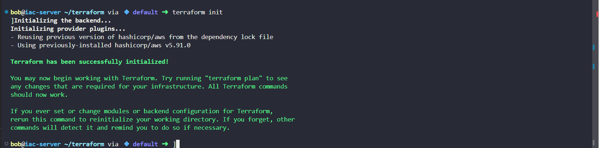
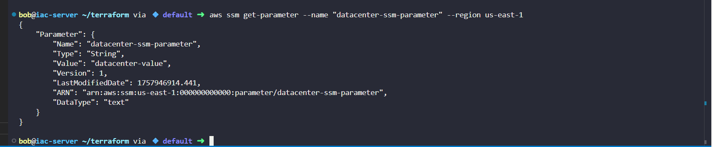

# Day 38: Creating AWS SSM Parameter with Terraform (KodeKloud Lab)

As part of my **100 Days of DevOps journey**, I worked on **automating AWS resource creation using Terraform**.  

On **Day 38**, the task was to **create an SSM parameter** named `datacenter-ssm-parameter` in AWS `us-east-1` using Terraform.

## Business Context

Developers and DevOps teams often need to **store configuration values or secrets centrally** for applications.  

SSM parameters allow:

- **Centralised configuration**: Avoid hardcoding values in apps.  

- **Consistency across environments**: Dev, QA, and prod can reference the same parameter.  

- **Auditability & versioning**: Changes to parameters are tracked automatically.  

Creating this parameter ensures **safe, repeatable, and auditable infrastructure provisioning**.

## Steps & Commands

1. **Navigate to Terraform working directory**

2. Create main.tf with provider and SSM parameter

vi main.tf

3. Initialise Terraform

terraform init

4. Validate Terraform configuration

terraform validate
Screenshot: 04_terraform_validate.png

5. Plan Terraform changes

terraform plan

6. Apply Terraform plan

terraform apply tfplan

Screenshot: 06_terraform_plan_apply.png

6. Verify SSM parameter exists using AWS CLI

aws ssm get-parameter --name "datacenter-ssm-parameter" --region us-east-1

## Benefits
1. Automated provisioning: No manual creation of SSM parameters.

2. Consistency & traceability: All environments can reference the same parameter.

3. Business value: Reduces configuration errors, improves deployment reliability, and saves time.

This demonstrates practical Terraform skills, AWS SSM management, and infrastructure automation — essential DevOps responsibilities.
