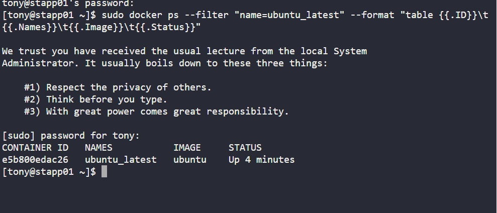
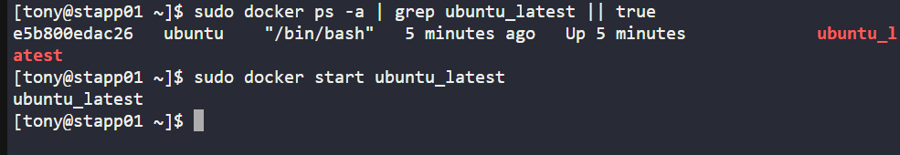
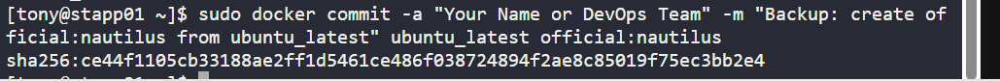
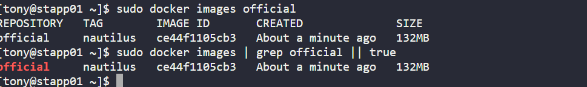

# Day 35: Creating a Backup Image from a Running Container (KodeKloud Lab)

Continuing my **100 Days of DevOps journey**, I explored how to **preserve developer changes inside a running container by committing it into a new reusable image**.  

On **App Server 1**, the goal was to take the running container `ubuntu_latest` and create a new image called `official:nautilus`.

## Business Context

In enterprise environments, developers often test and modify software inside containers.  

But if the container is stopped or removed, those changes are **lost**.  

**Business need**:  

- Create a **backup snapshot** of container changes.  

- Turn experimental work into a **portable, reusable image**.  

- Ensure continuity across environments (dev → QA → production).  

This guarantees **no loss of developer effort** while keeping the system reproducible and reliable.

## Key Steps & Commands

1. **Verified the target container (`ubuntu_latest`) exists**

sudo docker ps --filter "name=ubuntu_latest" --format "table {{.ID}}\t{{.Names}}\t{{.Image}}\t{{.Status}}"

sudo docker ps -a | grep ubuntu_latest || true

2. **Started the container**

sudo docker start ubuntu_latest

3. **Committed the running container into a new image**

sudo docker commit -a "Afolabi Aramide / DevOps Team" \

  -m "Backup: create official:nautilus from ubuntu_latest" \
  
  ubuntu_latest official:nautilus

4. **Listed images to confirm official:nautilus exists**

sudo docker images official

sudo docker images | grep official || true

5. **Inspected the new image for metadata**

sudo docker image inspect official:nautilus \

  --format '{{.Id}} - Created: {{.Created}} - Author: {{.Author}} - Comment: {{.Comment}}'

## Benefits of the Task
-Preservation of work: Developer changes are safe from container restarts.

-Reusability: Image can be shared across environments or teams.

-Traceability: Metadata (Author, Comment) captures context for audits.

-DevOps Alignment: Supports container versioning, a critical practice in CI/CD pipelines.
