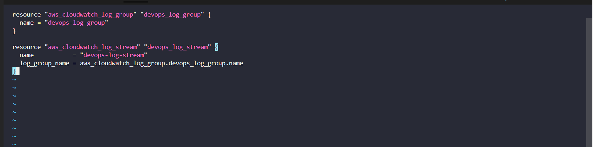
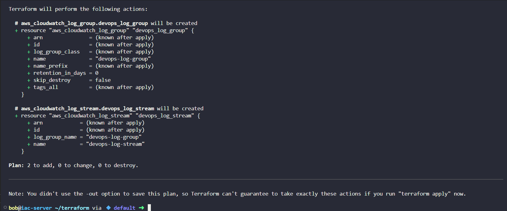
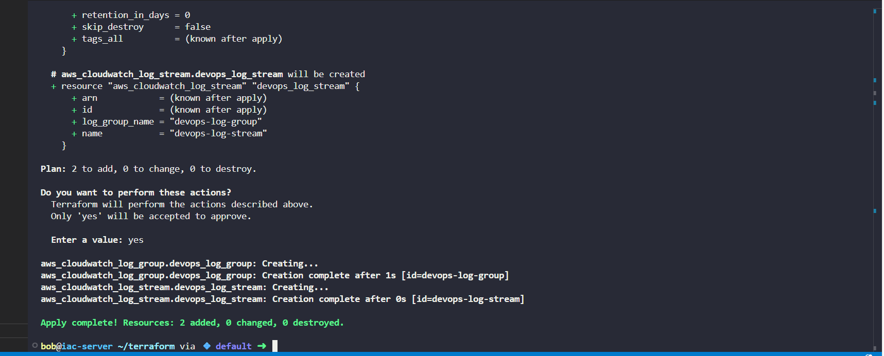
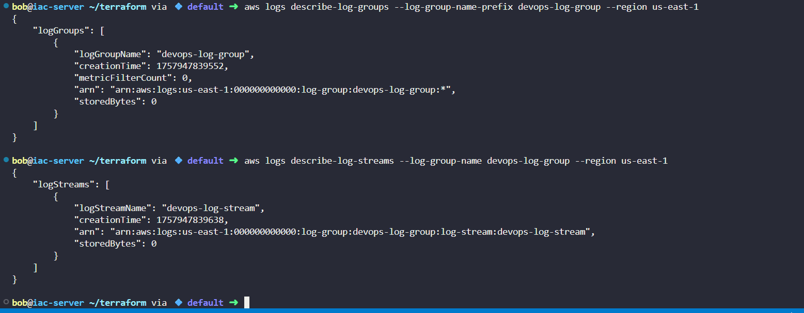

# Day 39: Creating CloudWatch Log Group & Stream with Terraform (KodeKloud Lab)

As part of my **100 Days of DevOps journey**, I worked on **automating AWS CloudWatch logging setup using Terraform**.  

On **Day 39**, the task was to **create a CloudWatch log group and log stream** using Terraform from the working directory `/home/bob/terraform`.

## Business Context

In production applications, **centralised logging** is critical for:

- **Monitoring and alerting** – track errors and events in real time  

- **Audit and compliance** – logs are stored securely for traceability  

- **Debugging and performance analysis** – developers and DevOps teams can review logs centrally  

This task ensures that logs are **structured, centralized, and easy to access**, which improves operational efficiency and reduces downtime.

## Steps & Commands

1. **Navigate to Terraform working directory**

cd /home/bob/terraform

pwd

2. **Create main.tf file**

vi main.tf

3. Initialise Terraform

terraform init

4. **Validate Terraform configuration**

terraform validate

5. **Plan Terraform changes**

terraform plan

6. **Apply Terraform plan**

terraform apply tfplan

7. **Verify CloudWatch log group and stream using AWS CLI**

aws logs describe-log-groups --log-group-name-prefix devops-log-group --region us-east-1

aws logs describe-log-streams --log-group-name devops-log-group --region us-east-1

## Benefits
-Centralised logging: Easier monitoring and troubleshooting

-Automation: Ensures reproducibility of infrastructure resources

-Business value: Reduces downtime, ensures compliance, and accelerates debugging

This task demonstrates hands-on experience with Terraform, AWS CloudWatch, and infrastructure automation, critical skills for DevOps roles.
