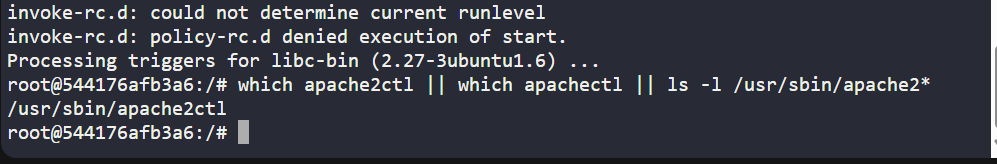
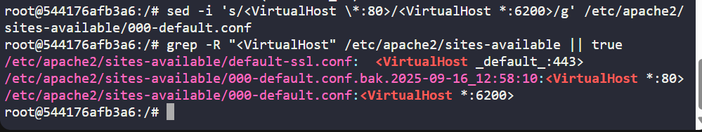
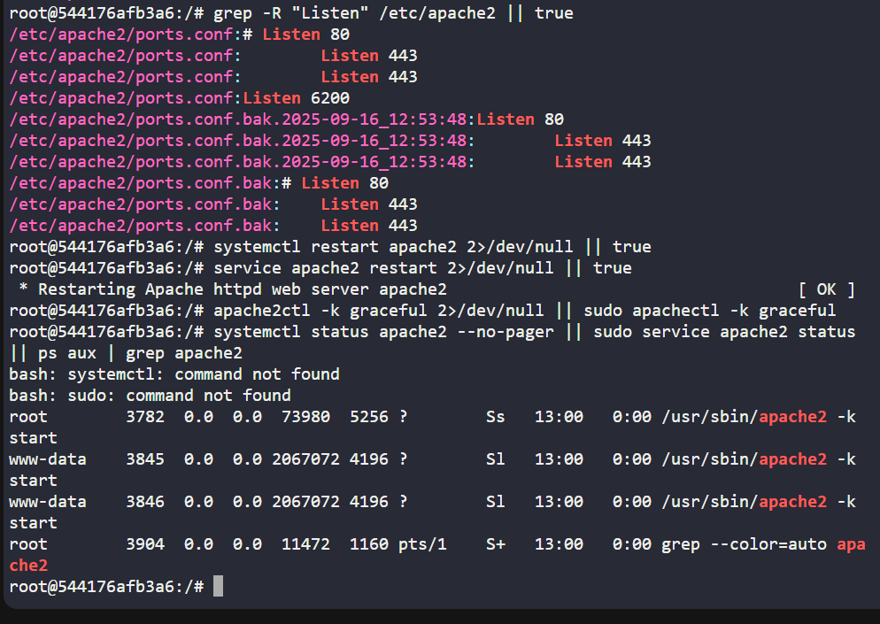
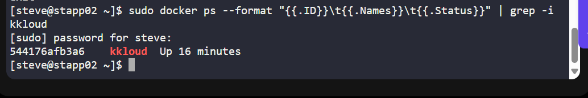

# Day 40 - Configuring Apache in a Container (KodeKloud Lab)
As part of my 100 Days of DevOps journey, the focus was on configuring services inside containers in a production-like environment. This lab was hosted on KodeKloud’s Stratos Datacenter, where I worked on App Server 2 to configure the kkloud container.

## Business Need & Project Essence
Modern applications often run inside containers. For DevOps engineers, it’s critical to know how to:

-Install and configure services inside containers,

-Change default ports to meet security or compliance needs,

-Keep containers running while ensuring services remain available.

This ensures scalability, maintainability, and security, which directly impacts business uptime and customer experience.

## Steps & Benefits
1. Install Apache2

-Benefit: Provides a reliable web server that is widely used in enterprise environments.

apt-get update -y

apt-get install apache2 -y

2. Configure Apache to Listen on Port 6200

Benefit: Running Apache on a non-default port improves security (reduces exposure to automated scans) and allows multiple services to run without conflict.

cp /etc/apache2/ports.conf /etc/apache2/ports.conf.bak.$(date +%F_%T)

sed -i.bak -E 's/^(Listen\s+).*/# \0/' /etc/apache2/ports.conf

echo "Listen 6200" | tee -a /etc/apache2/ports.conf

cp /etc/apache2/sites-available/000-default.conf /etc/apache2/sites-available/000-default.conf.bak.$(date +%F_%T)

sed -i 's/<VirtualHost \*:80>/<VirtualHost *:6200>/g' /etc/apache2/sites-available/000-default.conf

3. Restart & Verify Apache

Benefit: Ensures the service is actively listening on the configured port and serving HTTP requests.

service apache2 restart

apache2ctl -k graceful

ps aux | grep apache2

4. Exit & Confirm Container is Running

Benefit: Verifies the container remains in a healthy state after changes, ensuring business continuity.

exit

sudo docker ps --format "{{.ID}}\t{{.Names}}\t{{.Status}}" | grep -i kkloud

## Key Takeaways
-Learned how to install, configure, and validate services inside containers.

-Reinforced the importance of non-default configurations for better security and flexibility.

-Practiced verification and container lifecycle management, crucial for real DevOps roles.

This project strengthened my confidence in handling service configuration tasks in real-world DevOps environments, where uptime, security, and correct configuration directly impact the business.
