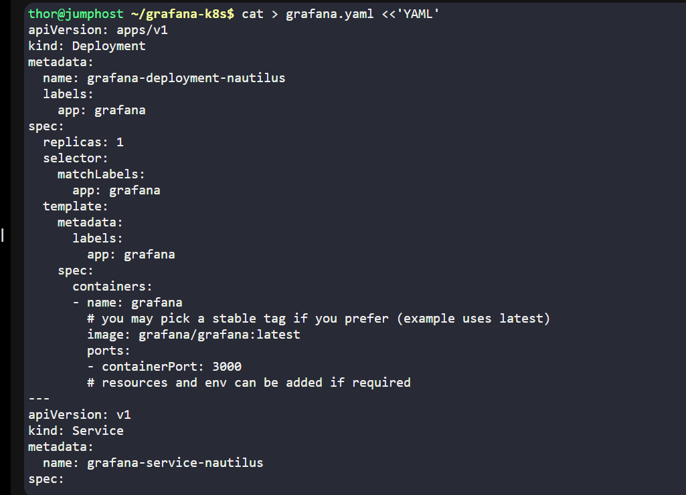
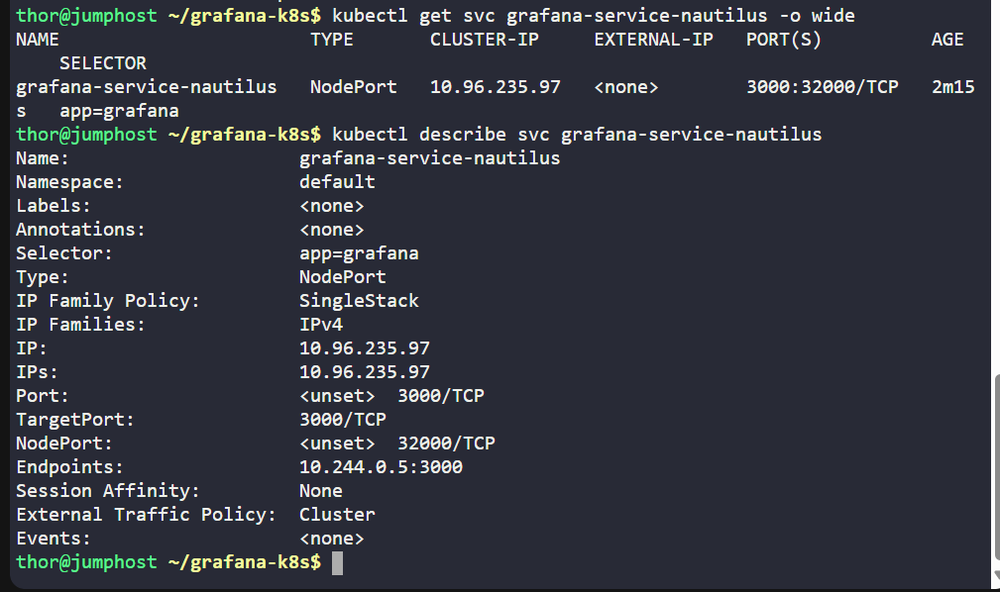

# Day 40 - Deploying Grafana on Kubernetes (KodeKloud)

## Project Overview
On Day 40, I deployed Grafana, a popular analytics and monitoring tool, on a Kubernetes cluster. This task simulates a real-world DevOps scenario where application analytics need to be collected and visualized without manual installation on individual servers.

## Business Value:
-Enables real-time monitoring of applications and infrastructure

-Provides dashboards for quick insights and operational efficiency

-Reduces the manual overhead of installing monitoring tools on every host

## Steps & Commands
1.	Create working directory on jump host

mkdir -p ~/grafana-k8s

cd ~/grafana-k8s

2.	Create Kubernetes Deployment and Service YAML

3.	Apply the YAML to the cluster

kubectl apply -f grafana.yaml

4.	Verify deployment and pods

kubectl get deployments,svc -o wide | grep grafana

kubectl rollout status deployment/grafana-deployment-nautilus --timeout=120s

kubectl get pods -l app=grafana -o wide

5.	Verify NodePort Service

kubectl get svc grafana-service-nautilus -o wide

kubectl describe svc grafana-service-nautilus

6.	Access Grafana via Lab GUI

## Lab Outcome
-Deployment: grafana-deployment-nautilus running

-Pod status: 1/1 Ready

-Service type: NodePort

-NodePort exposed: 32000

-Grafana is ready to accept connections at NodeIP:32000 (or via port-forward)

## Essence of the Project:
-Automates deployment of monitoring tools on Kubernetes

-Ensures consistent, reproducible setup across environments

-Prepares DevOps engineers to manage production-grade monitoring solutions
