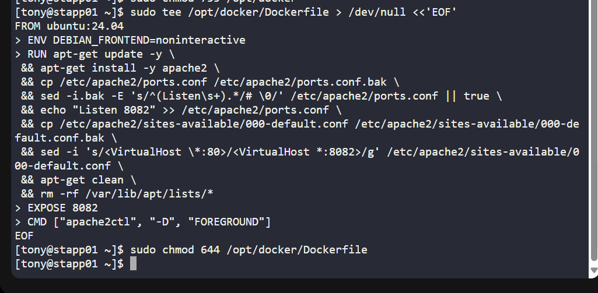
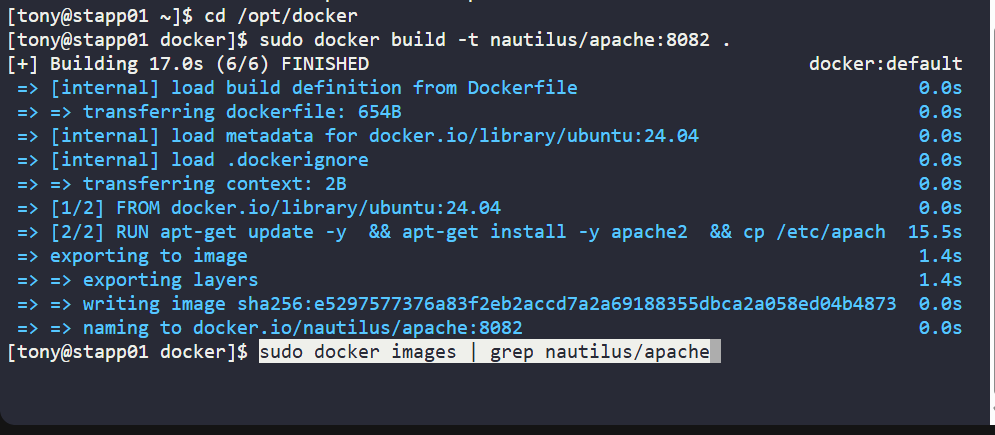
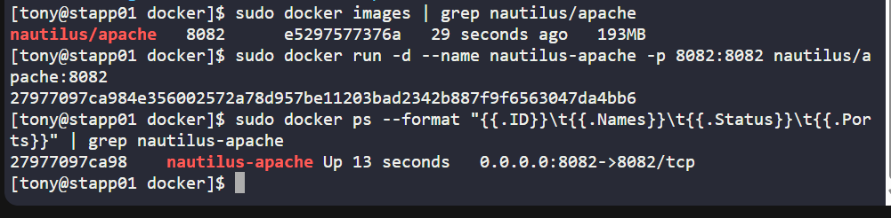
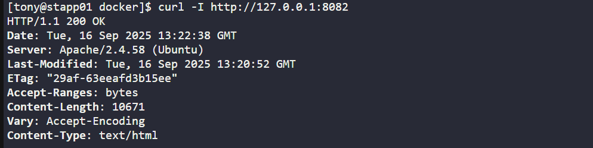

# Day 41 - Custom Apache Docker Image on Ubuntu 24.04)
## Context
As part of my 100 Days of DevOps (Day 41), I worked on creating a custom Docker image that uses ubuntu:24.04 as a base, installs Apache2, and configures it to listen on port 8082. This task was done in the KodeKloud labs environment on App Server 1.

This project demonstrates infrastructure automation, custom image building, and port configuration — all core skills for modern DevOps roles.

## Business Need
-Development teams often require customized images for testing and deployments (e.g., a specific web server version running on a non-default port).

-Building a Docker image with Apache2 preconfigured ensures consistency across environments (no manual tweaking needed).

-Using port 8082 instead of 80 avoids conflicts with existing services and makes the image flexible for multi-service deployments.

In real business scenarios, this means faster CI/CD pipelines, fewer environment-specific bugs, and a foundation for immutable infrastructure.

## Steps & Commands
1. Prepare directory and permissions

sudo mkdir -p /opt/docker

sudo chown root:root /opt/docker

sudo chmod 755 /opt/docker

2. Create Dockerfile (capital D is required)

sudo tee /opt/docker/Dockerfile > /dev/null <<'EOF'

FROM ubuntu:24.04

ENV DEBIAN_FRONTEND=noninteractive

RUN apt-get update -y \

 && apt-get install -y apache2 \
 
 && cp /etc/apache2/ports.conf /etc/apache2/ports.conf.bak \
 
 && sed -i.bak -E 's/^(Listen\s+).*/# \0/' /etc/apache2/ports.conf || true \
 
 && echo "Listen 8082" >> /etc/apache2/ports.conf \
 
 && cp /etc/apache2/sites-available/000-default.conf /etc/apache2/sites-available/000-default.conf.bak \
 
 && sed -i 's/<VirtualHost \*:80>/<VirtualHost *:8082>/g' /etc/apache2/sites-available/000-default.conf \
 
 && apt-get clean \
 
 && rm -rf /var/lib/apt/lists/*

EXPOSE 8082

CMD ["apache2ctl", "-D", "FOREGROUND"]

EOF

sudo chmod 644 /opt/docker/Dockerfile

3. Build Docker image

cd /opt/docker

sudo docker build -t nautilus/apache:8082 .

4. Run container

sudo docker run -d --name nautilus-apache -p 8082:8082 nautilus/apache:8082

5. Verify

sudo docker ps --format "{{.ID}}\t{{.Names}}\t{{.Status}}\t{{.Ports}}"

sudo docker logs nautilus-apache --tail 20

## Terraform (main.tf)
To tie in Infrastructure as Code, here’s how I could provision the same container using Terraform’s Docker provider:
provider "docker" {}

resource "docker_image" "apache" {
 
  name         = "nautilus/apache:8082"
  
  keep_locally = true

}

resource "docker_container" "apache" {

  name  = "nautilus-apache"
  
  image = docker_image.apache.image_id

  ports {
  
    internal = 8082
    
    external = 8082
  
  }

}

Run with:

terraform init

terraform apply -auto-approve

## Benefit
This task reinforced my ability to:

-Build custom Docker images with precise configurations.

-Ensure service portability and reproducibility.

-Leverage Terraform to define containers as code.

In a real enterprise environment, this workflow supports:

-Faster developer onboarding (images ready to use),

-Automated test environments,

-Scalable infrastructure that can be rebuilt anytime from code.
