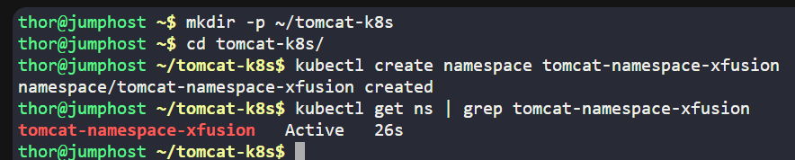
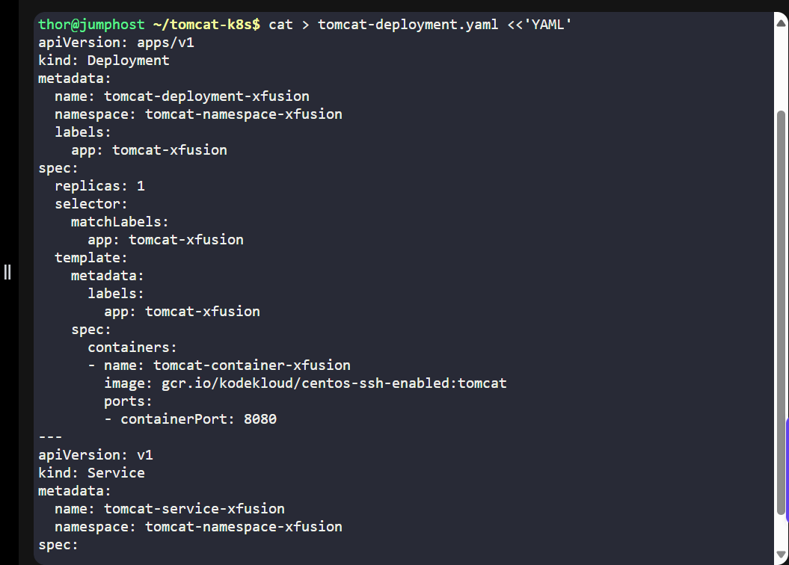
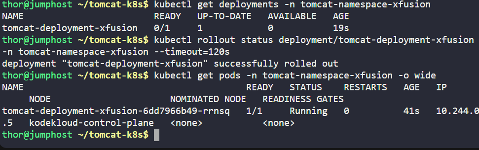

# Day 41 - Deploying a Java-based Tomcat Application on Kubernetes

## Project Overview
As part of continuous DevOps practices, the Nautilus development team required a scalable and isolated environment to deploy a Java-based application. The goal was to:

-Create a dedicated namespace for the application.

-Deploy the Tomcat app in Kubernetes.

-Expose the app via a NodePort service for internal testing and analytics.

## Business Need:
This ensures quick deployment, easy testing, and isolation from other workloads while meeting production-ready DevOps standards.

## Benefit:
-Fast environment provisioning

-Kubernetes-native scalability

-Reproducible infrastructure for future deployments

## Step-by-Step Implementation
1. Create a Namespace

kubectl create namespace tomcat-namespace-xfusion

kubectl get ns | grep tomcat-namespace-xfusion

2️. Create Deployment & Service YAML

3️. Apply Deployment & Service

kubectl apply -f tomcat-deployment.yaml

4️. Verify Deployment

kubectl get deployments -n tomcat-namespace-xfusion

kubectl rollout status deployment/tomcat-deployment-xfusion -n tomcat-namespace-xfusion --timeout=120s

kubectl get pods -n tomcat-namespace-xfusion -o wide

5️. Verify NodePort Service

kubectl get svc -n tomcat-namespace-xfusion

kubectl describe svc tomcat-service-xfusion -n tomcat-namespace-xfusion

6️. Access Application

Access applicatio  via lab GUI.

## Summary of Lab Outcomes
-Namespace tomcat-namespace-xfusion created ✅

-Deployment tomcat-deployment-xfusion running ✅

-Pod tomcat-container-xfusion ready ✅

-NodePort service 32227 exposed for testing ✅

## Business Value:
This task demonstrates Kubernetes-based deployment best practices for enterprise applications, enabling isolated, reproducible, and scalable environments while supporting continuous delivery.
