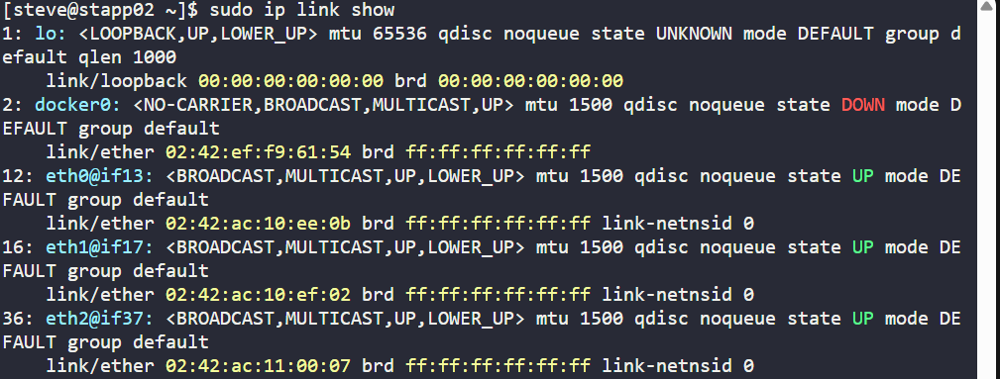
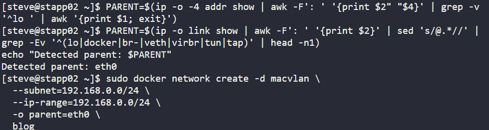
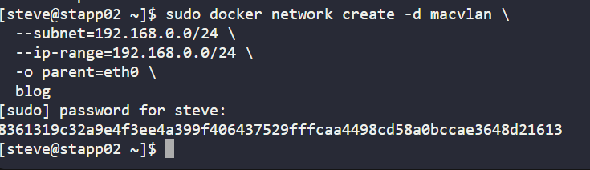
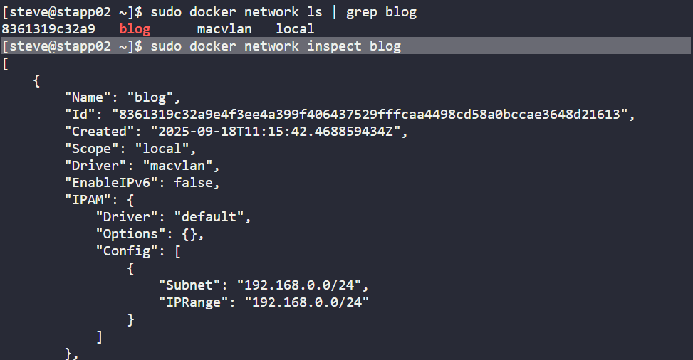

# Day 42: Creating a Docker Macvlan Network (blog)

As part of my 100 Days of DevOps journey on KodeKloud, Day 42 focused on advanced Docker networking, specifically, creating a Macvlan network named blog on App Server 2.

This exercise builds on my earlier Docker and networking tasks and simulates how businesses extend containerised applications into existing enterprise networks securely and efficiently.

## Business Need

Modern organisations often run hybrid systems where containers must:

-Integrate with existing VLANs

-Communicate with external networks as if they were physical hosts

-Ensure IP address control for compliance, monitoring, or multi-tenant environments

-Using Docker Macvlan networks allows containers to get their own unique IPs directly on the physical network, enabling seamless integration with traditional systems without NAT overhead.

## Steps Performed
**1. Verified Docker Installation**

Before proceeding, I confirmed Docker was running on the server.

sudo docker version

sudo systemctl status docker --no-pager

**2. Identified Network Interfaces**

To attach Macvlan correctly, I inspected the server’s interfaces and detected the parent (eth0).

sudo ip -4 addr show

sudo ip link show

**Detect parent interface**
PARENT=$(ip -o link show | awk -F': ' '{print $2}' | sed 's/@.*//' | grep -Ev '^(lo|docker|br-|veth|virbr|tun|tap)' | head -n1)
echo "Detected parent: $PARENT"

**3. Created the blog Network with Macvlan**

Using the macvlan driver, I created a network with:

Subnet: 192.168.0.0/24

IP Range: 192.168.0.0/24

Parent Interface: eth0

sudo docker network create -d macvlan \
  --subnet=192.168.0.0/24 \
  --ip-range=192.168.0.0/24 \
  -o parent=eth0 \
  blog

**4. Validated the Network**

Confirmed successful creation and inspected details.

sudo docker network ls | grep blog

sudo docker network inspect blog

## Outcome

-Successfully created a business-ready Docker Macvlan network named blog.

-Containers launched on this network will:

-Receive direct IPs from the VLAN,

-Bypass NAT, and

Integrate seamlessly with existing enterprise infrastructure.

This exercise highlights the importance of network architecture in containerized environments, ensuring security, scalability, and compliance for business applications.
