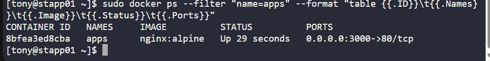

# Day 43 - Running Nginx Container on Custom Port

As part of my 100 Days of DevOps journey on KodeKloud, Day 43 focused on deploying a lightweight Nginx container using Docker.

This exercise simulates a common scenario where businesses need to expose web applications on non-standard ports while ensuring reliability and automation in containerised environments.

## Business Need

Organisations frequently deploy Nginx as:

A reverse proxy for microservices

A lightweight web server for static or containerised apps

A secure gateway mapped to custom host ports

By mapping container port 80 to host port 3000, we ensure applications are accessible externally without interfering with other services. Adding restart policies guarantees high availability and minimal downtime.

## Steps Performed
**1. Verified Docker Installation**

Confirmed Docker was installed and running.

sudo docker version

**2. Checked for Conflicts on Host Port 3000**

Ensured no other service was using port 3000.

sudo ss -ltnp | grep ':3000' || true

**3. Pulled Nginx Alpine Image**

Downloaded the lightweight Nginx Alpine image for efficient deployment.

sudo docker pull nginx:alpine

**4. Removed Old Containers (if any)**

Cleaned up any existing container named apps.

sudo docker rm -f apps

**5. Deployed Nginx Container**

Created a container named apps, with restart policy and port mapping.

sudo docker run -d --name apps \
  --restart unless-stopped \
  -p 3000:80 \
  nginx:alpine

**6. Verified Running Container**

Checked container details and confirmed host-to-container port mapping.

sudo docker ps --filter "name=apps" --format "table {{.ID}}\t{{.Names}}\t{{.Image}}\t{{.Status}}\t{{.Ports}}"

sudo docker inspect --format='{{json .NetworkSettings.Ports}}' apps

## Outcome

-Successfully launched Nginx container (apps) on host port 3000.

-Ensured high availability with restart policies.

-Validated that port mappings worked correctly, making the application externally accessible.

This task demonstrates how DevOps engineers enable scalable and reliable web deployments using Docker, bridging the gap between development needs and business operations.
