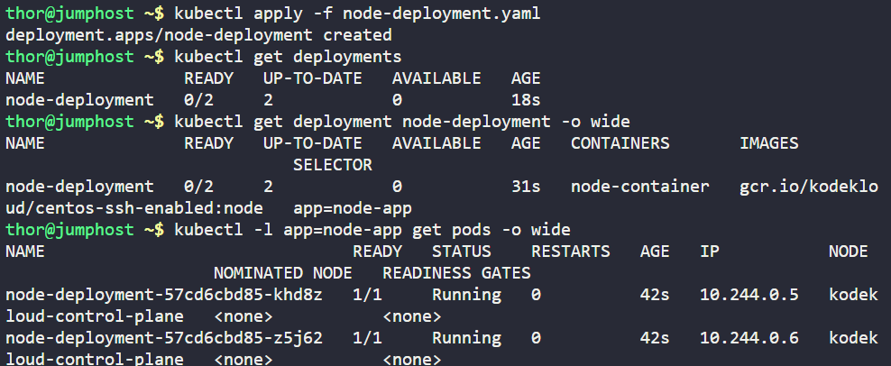
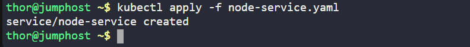
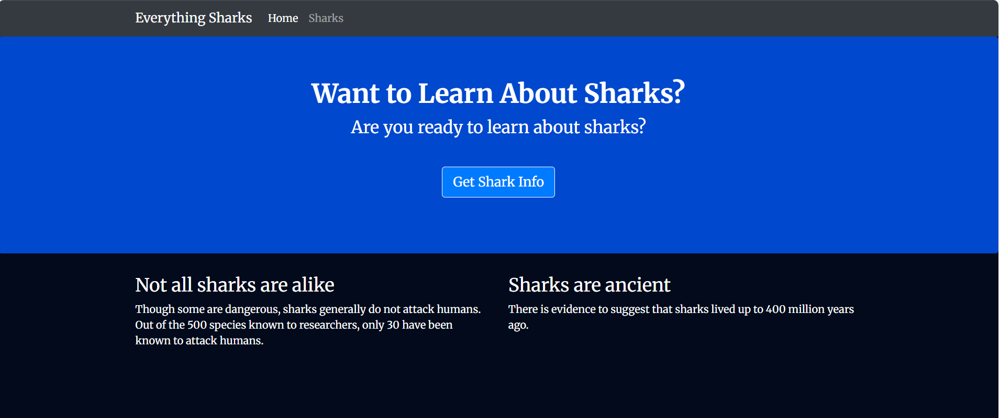

# Day 43 - Node Application Deployment on Kubernetes

Objective: Deploy a Node-based application as a Kubernetes Deployment and expose it via a NodePort Service. This allows the application to be scalable, highly available, and accessible for testing and integration.

## Business Value:

Ensures application resilience using Kubernetes replicas.

Provides predictable access for QA, monitoring, and internal tools via NodePort.

Demonstrates DevOps practices in automating deployment, service exposure, and observability.

**1️. Create Deployment**

Deployment YAML (|node-deployment.yaml):

**Commands:**

kubectl apply -f node-deployment.yaml

kubectl rollout status deployment/node-deployment --timeout=120s

kubectl -l app=node-app get pods -o wide

**2️. Create NodePort Service**

Service YAML (node-service.yaml):

**Commands:**

kubectl apply -f node-service.yaml

kubectl get svc node-service -o wide

kubectl -n default describe svc node-service

kubectl get endpoints node-service

 
**3️. Verify Application**

kubectl get nodes -o wide       # check node IPs

Used NodeApp button in KodeKloud lab to confirm application accessibility.

**4️. Summary of Benefits**

Step	Benefit

-Deployment (2 replicas)	High availability and resiliency for production workloads.

-NodePort Service	Predictable and external access for QA, integration, and monitoring.

-Labels & selectors	Clear application grouping, enables scaling and automation.
