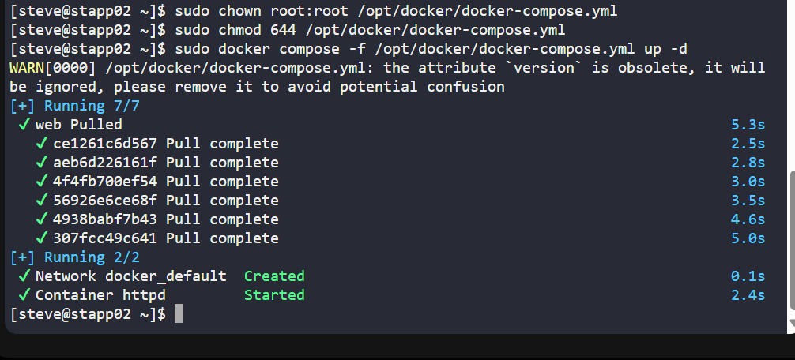

# Day 44: Hosting a Static Website with Docker Compose

As part of my 100 Days of DevOps Challenge, today I focused on deploying a static website using a containerized httpd web server with Docker Compose.

## Business Need & Essence
Organisations often need a quick, repeatable, and isolated way to host static websites (for documentation, marketing landing pages, or internal tools). By containerising Apache httpd with Docker Compose:

-Rapid deployment: faster than manual server setup.

-Portability: consistent environment across development, testing, and production.

-Data integrity: website files mounted from the host, avoiding accidental modification in the container.

This task shows how DevOps practices streamline infrastructure setup to align with business agility and reduce operational overhead.

## Step-by-Step Implementation
1️. Pre-checks

Verify Docker and Compose availability:

docker compose version

2. Prepare Working Directory

sudo mkdir -p /opt/docker

sudo chmod 755 /opt/docker

3️. Create the Compose File

File: /opt/docker/docker-compose.yml

version: "3"
services:
  web:
    image: httpd:latest
    container_name: httpd
    ports:
      - "3003:80"
    volumes:
      - /opt/dba:/usr/local/apache2/htdocs

4️. Secure File Permissions

sudo chown root:root /opt/docker/docker-compose.yml

sudo chmod 644 /opt/docker/docker-compose.yml

5️. Deploy the Container

sudo docker compose -f /opt/docker/docker-compose.yml up -d

6️. Verify Container & Website

sudo docker ps --filter "name=httpd" --format "table {{.ID}}\t{{.Names}}\t{{.Image}}\t{{.Ports}}\t{{.Status}}"

curl -I http://localhost:3003

## Key Takeaways

Learned how to deploy a web server with Docker Compose using best practices.

Understood the importance of port mapping (host ↔ container communication).

Reinforced the concept of volume mounting for static content, ensuring business-critical data is preserved outside of containers.
