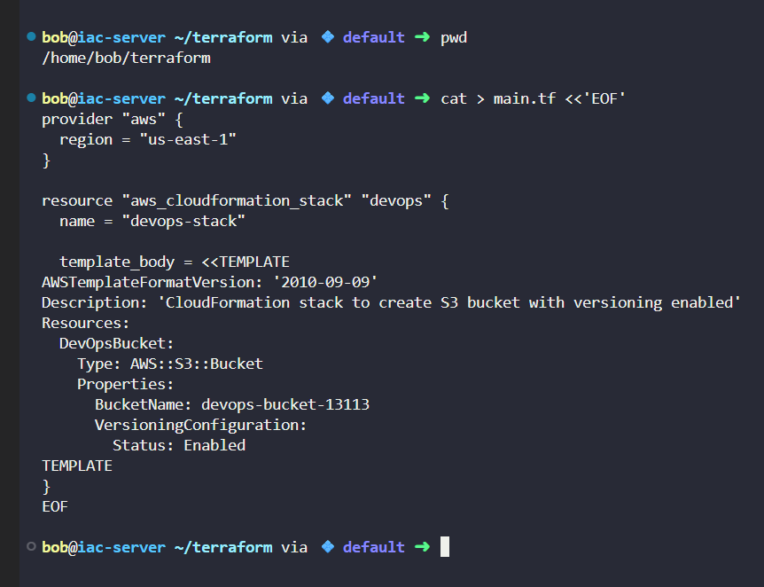
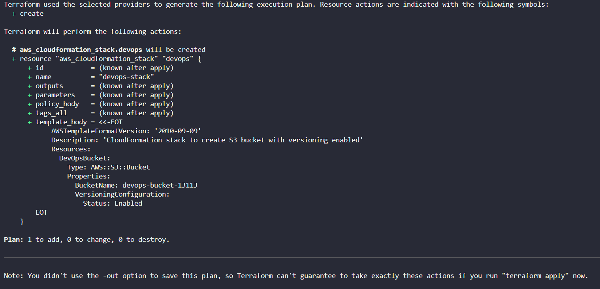
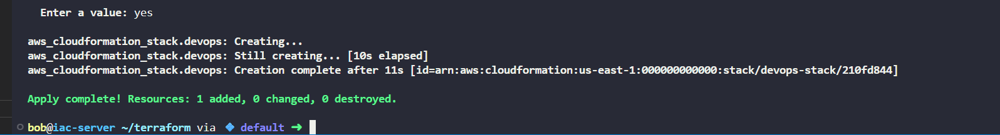
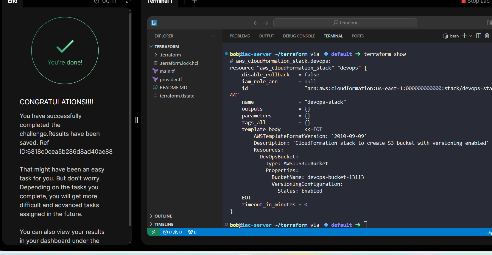

# Day 44: Automating S3 with Terraform + CloudFormation

As part of my 100 Days of DevOps/Cloud Challenge, I automated the provisioning of an S3 bucket with versioning enabled using Terraform and AWS CloudFormation.

## Business Need & Essence

Organisations rely on S3 for critical storage like logs, artifacts, and backups.

Without versioning, accidental overwrites or deletions can cause data loss.

By combining Terraform (IaC orchestration) with CloudFormation (native AWS IaC) we:

-Ensure repeatable, consistent provisioning of storage resources

-Enable data protection with versioning

-Simplify compliance and disaster recovery

This setup reflects real business scenarios where teams need governed, auditable, and resilient cloud infrastructure.

## Step-by-Step Implementation
**1. Prepare Working Directory**

cd /home/bob/terraform

**2️. Create main.tf**

**3️. Format, Validate, and Initialize**

terraform fmt

terraform validate

terraform init

**4️. Plan and Apply**

terraform plan

terraform apply -auto-approve

**5️. Verify**
terraform show

## Key Takeaways
1. Learned to integrate Terraform with CloudFormation for flexible IaC.
2. Reinforced the importance of S3 versioning for data durability and recovery.
3. Practiced end-to-end IaC workflow: write, validate, apply, verify.
