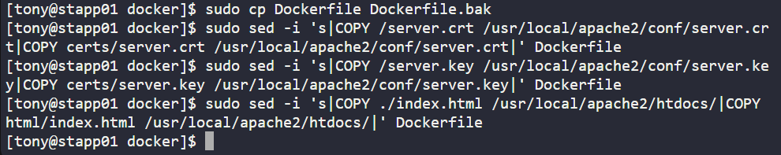

# Day 45: Fixing Dockerfile Build Issues for Apache Web Server

As part of my 100 Days of DevOps journey, today I focused on troubleshooting and fixing a broken Dockerfile.

This exercise highlights how DevOps engineers support business needs by ensuring application images can be built, secured, and deployed consistently.

## Business Need

-The Nautilus DevOps team needed a reliable custom Apache HTTPD image:

-Listening on port 8080 (instead of 80) for environment compatibility.

-Serving a custom index.html page.

-Configured with SSL modules (mod_ssl and socache_shmcb) for secure communication.

-A broken Dockerfile meant that the application couldn’t be containerised, blocking deployments.

-Fixing this directly impacts delivery speed and reduces downtime risk.

## Steps Taken
**1. Inspect project structure**

cd /opt/docker

sudo ls -la

sudo ls -la certs

sudo ls -la html

**2. Fix incorrect COPY paths in Dockerfile**

-The original Dockerfile incorrectly pointed to /server.crt, /server.key, and ./index.html.

-Docker requires relative paths inside the build context.

**-Updated COPY commands:**

COPY certs/server.crt /usr/local/apache2/conf/server.crt

COPY certs/server.key /usr/local/apache2/conf/server.key

COPY html/index.html /usr/local/apache2/htdocs/

**3. Adjust file permissions**

-Ensured Docker build could read the required files:

sudo chmod -R a+r certs html

sudo ls -la certs

sudo ls -la html

**4. Build the Docker image**

DOCKER_BUILDKIT=0 sudo docker build --no-cache -t naut-app:1.0 .

**5. Run and verify the container**

sudo docker run -d --name naut-test -p 8080:8080 naut-app:1.0

sudo docker ps -a

curl -I http://localhost:8080

curl http://localhost:8080

## Outcome

-Fixed the Dockerfile so the image builds cleanly.

-Ensured Apache listens on port 8080.

-Confirmed index.html content is served via container.

-Demonstrated troubleshooting of broken CI/CD pipelines where incorrect paths or permissions block delivery.

## Key Takeaway

-This project emphasizes the business value of DevOps troubleshooting:

-Preventing pipeline failures saves engineering hours.

-Reliable container images enable faster deployments and greater consistency across environments.

-Aligns with real-world DevOps responsibilities: debugging, securing, and automating infrastructure.
