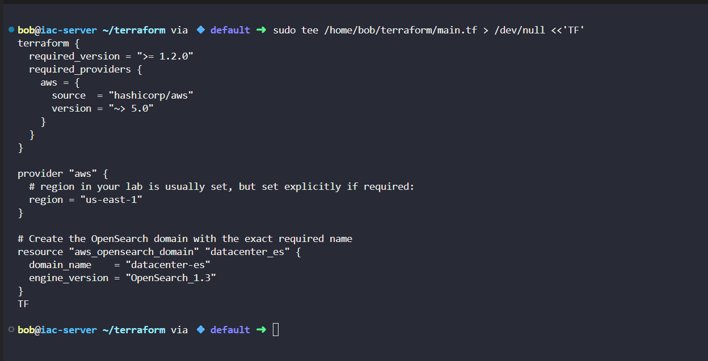
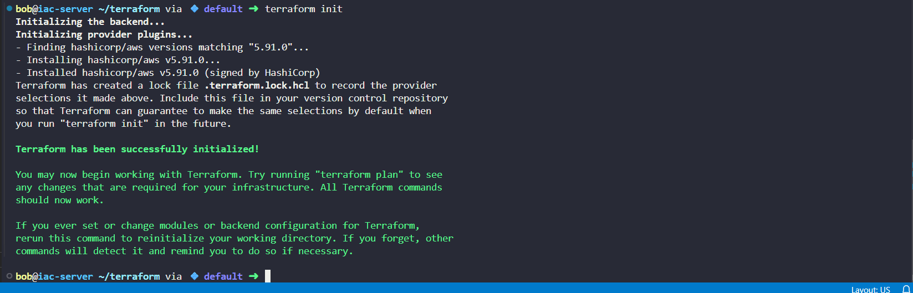
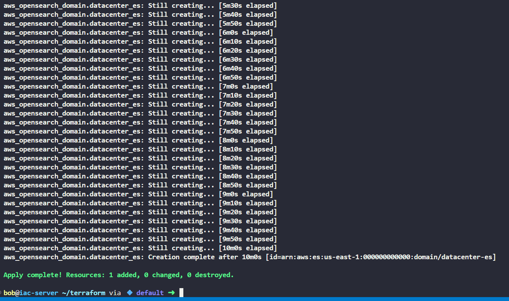
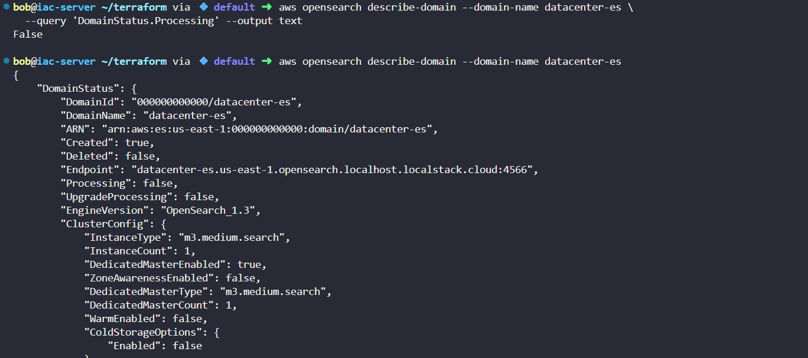
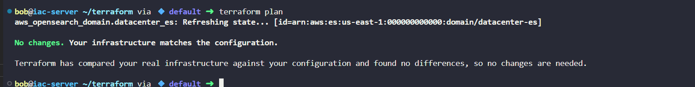

# Day 45: Provisioning Amazon OpenSearch Domain with Terraform

As part of my 100 Days of DevOps/Cloud journey, I used Terraform to automate provisioning of an Amazon OpenSearch Service domain.

## Business Need

-Modern applications generate large volumes of logs that are critical for:

-Monitoring application health

-Troubleshooting issues quickly

-Meeting compliance/audit requirements

-Manually setting up search infrastructure is error-prone and time-consuming.

-Using Terraform IaC, we ensure repeatability, speed, and scalability, aligning with DevOps principles.

## Steps Taken
**1. Created Terraform configuration (main.tf)**

**2. Initialized and validated Terraform project**

cd /home/bob/terraform

terraform init

terraform validate

terraform fmt

**3. Planned and applied the infrastructure**

terraform plan

terraform apply -auto-approve

**4. Verified domain creation**

aws opensearch describe-domain --domain-name datacenter-es

terraform show

terraform state list

**5. Ensured infra matches configuration**

terraform plan

**Output: "No changes. Your infrastructure matches the configuration."**

## Outcome

-Successfully provisioned Amazon OpenSearch Service domain (datacenter-es).

-Automated process ensures logs can be indexed and searched efficiently.

-Infrastructure is idempotent: safe re-runs without duplication.

-Demonstrated ability to use IaC for cloud-native observability solutions.

## Key Takeaway

-This task demonstrates how Infrastructure as Code (IaC) enables DevOps engineers to:

-Deliver search & analytics infrastructure on-demand.

-Provide business resilience by automating log management systems.

-Free teams to focus on innovation instead of manual setup.
