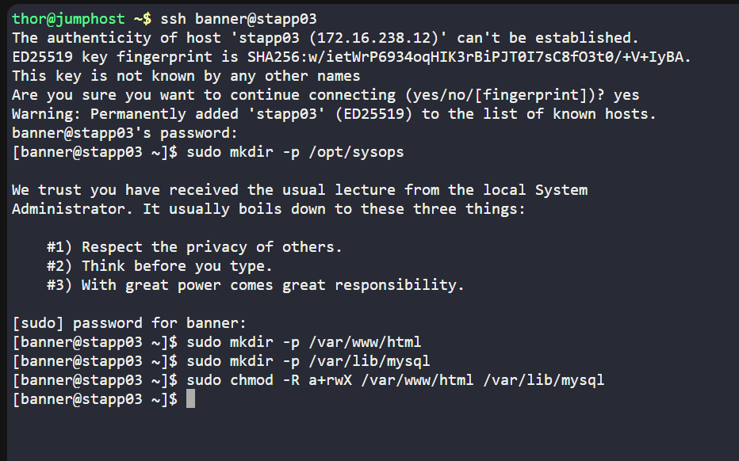

# Day 46: Containerised PHP + MariaDB Deployment on App Server 3

## Project Context:
As part of the Nautilus DevOps initiative, we deployed a PHP web application with a MariaDB backend using Docker Compose. This lab addressed the business need to quickly test apps in isolated environments before going live, ensuring consistency, reliability, and repeatable deployments.

## Business Need:
-Standardised app deployment across environments.

-Faster testing and validation before production release.

-Persistent data with host volumes ensures stability.

## Steps Executed
**1. Prepare Directories & Permissions**

sudo mkdir -p /opt/sysops /var/www/html /var/lib/mysql

sudo chmod -R a+rwX /var/www/html /var/lib/mysql

cd /opt/sysops

**2️. Create Docker Compose File**

**3. Create Sample Web File**

**4️. Start Docker Compose Stack**

sudo docker compose up -d

sudo docker ps

**5️. Verify Web App & Database**

curl http://localhost:6400/

sudo docker exec -it mysql_blog mariadb -u bloguser -p'ComplexPass!234' -e "SHOW DATABASES;"

## Benefits Achieved

-Rapid deployment of multi-container apps.

-Persistent data with host volumes ensures data survives container restarts.

-Simplified testing for dev and QA teams.

-Prepares team for scalable, production-grade deployment pipelines.

## Conclusion:
Day 46 reinforced the power of Docker Compose for consistent, reproducible, and isolated app deployments. This lab directly contributes to business agility and reduced deployment risk while keeping environments consistent across Dev, QA, and production.
