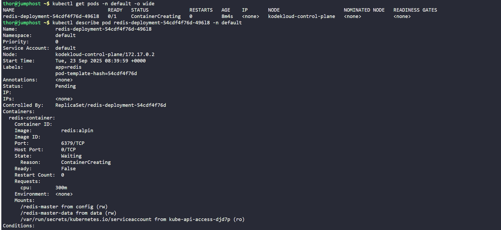
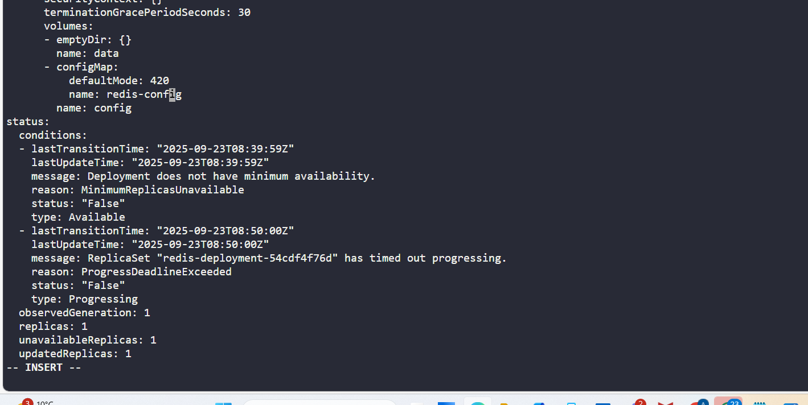
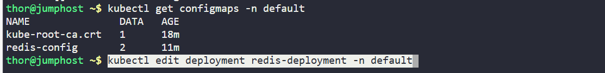
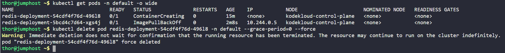
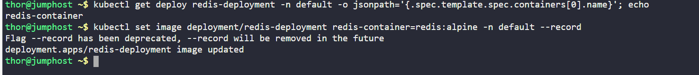
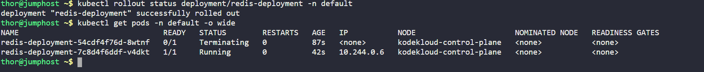
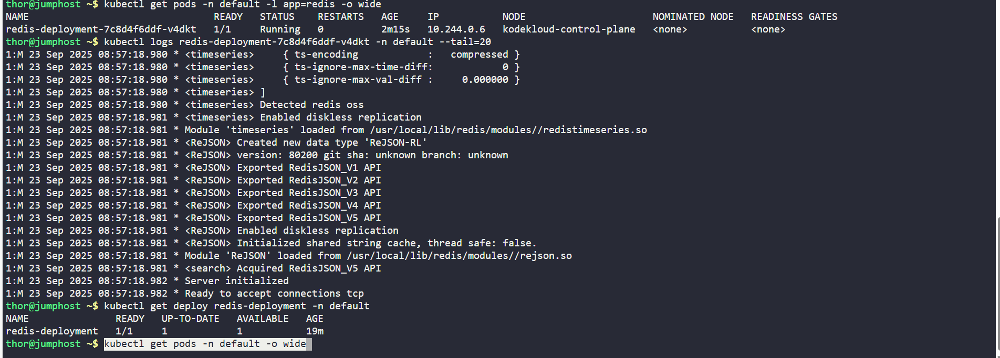
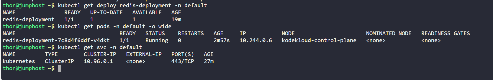

# Day 46 of 100 Days of DevOps: Fixing Redis Deployment on Kubernetes (KodeKloud Lab)

As part of my **100 Days of DevOps journey**, today I worked on troubleshooting and fixing a broken **Redis app deployment** in a Kubernetes cluster.  

## Business Context
Redis is often used in production as a **caching layer** or **in-memory database** for high-performance applications.  

If Redis is down, business applications relying on it may face:

- ❌ Slow performance due to missing cache  

- ❌ Application downtime if Redis is a primary datastore  

- ❌ Revenue/operational loss due to outages  

That’s why ensuring Redis deployments run smoothly on Kubernetes is critical in **real-world DevOps**.

## What Went Wrong
The Redis deployment failed because of:

1. **ConfigMap typo**: Deployment referenced `redis-conig` instead of `redis-config`.  
2. **Wrong container image**: Used `redis:alpin` instead of the correct `redis:alpine`.  

Both issues prevented pods from starting.

## Steps Taken
Here’s how I identified and resolved the issue:

1. **Checked pods and described failing pod**  

kubectl get pods -n default -o wide

kubectl describe pod redis-deployment-54cdf4f76d-496l8 -n default

3. **Verified ConfigMaps**

kubectl get configmaps -n default

3. **Edited deployment to fix ConfigMap reference**

kubectl edit deployment redis-deployment -n default

4. **Deleted stuck pod and fixed image typo**

kubectl delete pod redis-deployment-54cdf4f76d-496l8 -n default --grace-period=0 --force

kubectl set image deployment/redis-deployment redis-container=redis:alpine -n default

5. **Rolled out deployment and verified logs**

kubectl rollout status deployment redis-deployment -n default
kubectl logs <running-pod> -n default --tail=20

6. **Final verification**

kubectl get deploy redis-deployment -n default

kubectl get pods -n default -o wide

kubectl get svc -n default

## Outcome
-Redis pod is running and stable in the cluster.

-Deployment fixed with correct ConfigMap + image.

-Demonstrated end-to-end troubleshooting in Kubernetes.

This exercise reinforced:

The importance of attention to detail in YAML manifests.

Using kubectl describe and logs to pinpoint root causes quickly.

How fixing small configuration errors prevents big outages in production.
