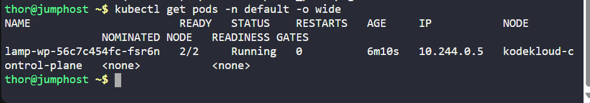
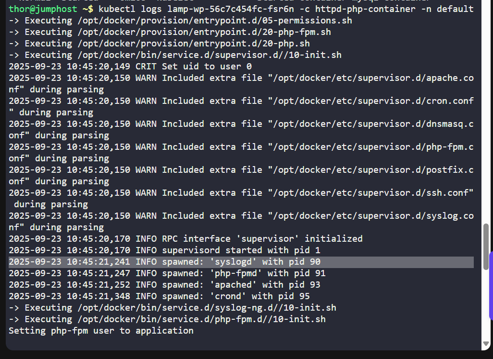
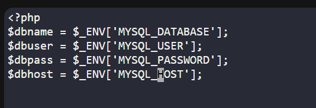
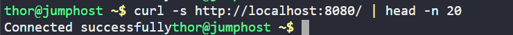
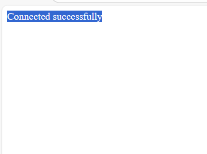

# Day 47 - Fixing WordPress LAMP Stack on Kubernetes

**Project:** WordPress LAMP Stack Troubleshooting & Service Fix  

**Environment:** KodeKloud Kubernetes Lab  

## Objective
As part of Day 47 of my 100 Days of DevOps journey, I worked on troubleshooting a WordPress website deployed on a LAMP stack inside Kubernetes.  

The application was previously accessible but experienced downtime due to database connection issues and misconfigured service ports.  

**Business Need:**  
Ensuring web applications are reliably available on Kubernetes is critical for business continuity, user satisfaction, and minimizing downtime.

## Steps Taken

### 1. Verify Pod and Service Status
```
kubectl get pods -n default -o wide
kubectl get svc lamp-service -n default -o wide
kubectl get nodes -o wide
```

**2. Check Application Logs**
```
kubectl logs lamp-wp-56c7c454fc-fsr6n -c httpd-php-container -n default
```
Identified PHP parse errors due to incorrect environment variable usage.


**3. Inspect and Fix PHP Application**
```
kubectl exec -it lamp-wp-56c7c454fc-fsr6n -c httpd-php-container -n default -- sh
vi /app/index.php
```
Corrected environment variable syntax:

```
$dbname = $_ENV['MYSQL_DATABASE'];
$dbuser = $_ENV['MYSQL_USER'];
$dbpass = $_ENV['MYSQL_PASSWORD'];
$dbhost = $_ENV['MYSQL_HOST'];

$connect = mysqli_connect($dbhost, $dbuser, $dbpass) or die("Unable to Connect to '$dbhost'");
$test_query = "SHOW TABLES FROM $dbname";
```
Tested connection locally:
```
curl -s http://localhost/ | head -n 20
```


**4. Verify Service & Ports**
```
kubectl get svc lamp-service -n default -o yaml
kubectl edit svc lamp-service -n default
kubectl port-forward deployment/lamp-wp 8080:80 -n default
curl -s http://172.17.0.2:30008/ | head -n 20
```
Corrected NodePort misconfiguration: targetPort 80 to match container port.



**5. Confirm Full Application Functionality**
Application connects successfully to MySQL.

NodePort service is accessible externally.

Downtime issue resolved, ensuring business continuity.


## Benefits & Learning
1. Hands-on troubleshooting of a live Kubernetes deployment.
2. Learned to identify and fix PHP environment variable issues inside containers.
3. Corrected NodePort misconfiguration to expose the application reliably.
4. Reinforced the importance of aligning container ports with Kubernetes services.

## Outcome
-WordPress application is fully operational

-NodePort service accessible on port 30008

-Lab passed successfully

This README continues the story of Day 47 in my 100 Days of DevOps journey, highlighting hands-on troubleshooting, Kubernetes debugging, and business-oriented solutions.

