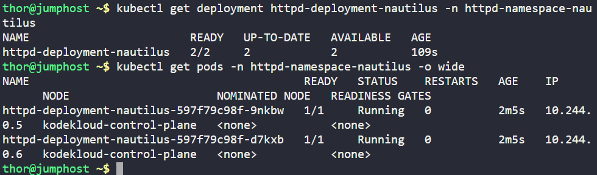

## Day 48:  Nautilus httpd on Kubernetes

Deployed an Apache (httpd:latest) application to a Kubernetes cluster using a single, repeatable manifest — demonstrating namespace isolation, availability (2 replicas) and external access via NodePort. Part of my 100 Days of Devops journey (Day 48).

**Why this matters (business need & benefit)?**

**Business need:** Quickly deliver a stable web service that’s isolated, scalable and reachable for testing or internal consumers.

**Benefit:** Faster, repeatable deployments (IaC) reduce manual errors, improve uptime (replicas) and make onboarding easier for QA and SRE teams.

**What I built (essence / each step)**

-Namespace (httpd-namespace-nautilus): multi-team isolation, simple resource scoping.

-Deployment (httpd-deployment-nautilus, httpd:latest, replicas: 2): ensures basic availability and simplified rolling updates.

-Service (httpd-service-nautilus, NodePort:30004): exposes the app for testing and integration with other infra.

**File: httpd-nautilus.yaml**
```
apiVersion: v1
kind: Namespace
metadata:
  name: httpd-namespace-nautilus
---
apiVersion: apps/v1
kind: Deployment
metadata:
  name: httpd-deployment-nautilus
  namespace: httpd-namespace-nautilus
spec:
  replicas: 2
  selector:
    matchLabels:
      app: httpd-nautilus
  template:
    metadata:
      labels:
        app: httpd-nautilus
    spec:
      containers:
      - name: httpd
        image: httpd:latest
        ports:
        - containerPort: 80
---
apiVersion: v1
kind: Service
metadata:
  name: httpd-service-nautilus
  namespace: httpd-namespace-nautilus
spec:
  type: NodePort
  selector:
    app: httpd-nautilus
  ports:
  - port: 80
    targetPort: 80
    nodePort: 30004
```

## Commands used
**create file (on jump_host)**

```
cat > httpd-nautilus.yaml <<'EOF'
... (file content above) ...
EOF
```

**apply manifest**
```
kubectl apply -f httpd-nautilus.yaml
```


**quick verification**
```
kubectl get ns httpd-namespace-nautilus -o yaml
kubectl get deploy httpd-deployment-nautilus -n httpd-namespace-nautilus
kubectl get pods -n httpd-namespace-nautilus -o wide
kubectl get svc httpd-service-nautilus -n httpd-namespace-nautilus
```



**tested via Lab environment: App running**

