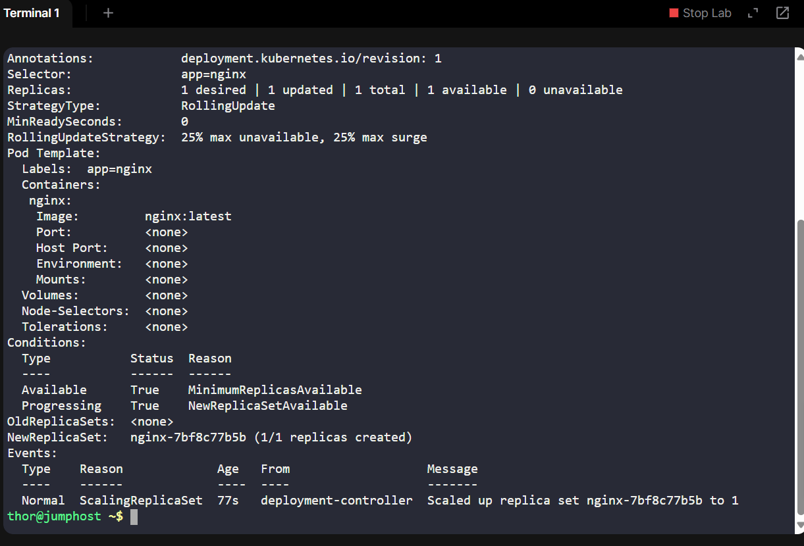
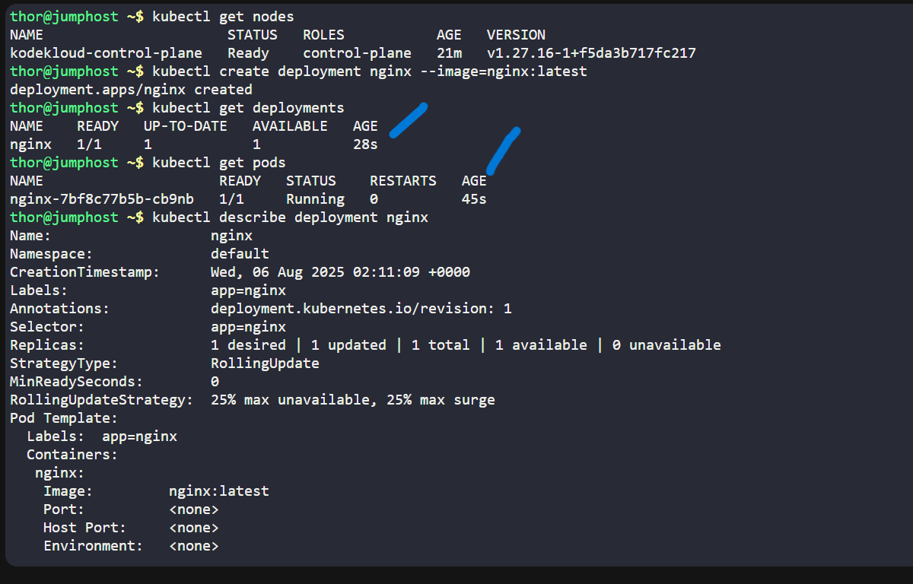

# Day 48 - Kubernetes Nginx Deployment

## Task Summary
As part of the **Nautilus DevOps project**, I worked on deploying a containerized web server (`nginx`) using **Kubernetes**.

The lab environment provided a **pre-configured Kubernetes cluster** accessible via `kubectl` on the `jump_host`. This mimics real-world access where DevOps engineers operate from secure jump servers.

---

## Objectives
-Create a Kubernetes **deployment** named `nginx`

-Use the image `nginx:latest`

-Verify that the deployment and pods are running successfully

---

## Commands Used

### Create deployment with explicit image tag
kubectl create deployment nginx --image=nginx:latest

### Verify deployment
kubectl get deployments

### Verify running pod
kubectl get pods

### (Optional) Describe deployment details
kubectl describe deployment nginx

			

## Business Context & Relevance
In modern microservices architectures, Kubernetes is used to deploy, scale, and manage applications efficiently.

This task simulates a typical DevOps responsibility:

Automating deployment of web servers (like nginx)

Leveraging infrastructure that's already provisioned (e.g., managed clusters or internal tools)

Ensuring repeatable, declarative deployments

Such practices align with:

-Security policies (centralized access via jump host)

-CI/CD pipelines

-Uptime and scaling demands in production

## Skills Demonstrated
Kubernetes CLI (kubectl)

Deployment and pod lifecycle

Docker image handling in K8s

Working in restricted/provisioned environments (jump host → K8s cluster)

## Related DevOps Concepts
Kubernetes (K8s)

Container orchestration

Declarative infrastructure

Immutable infrastructure

CI/CD automation
