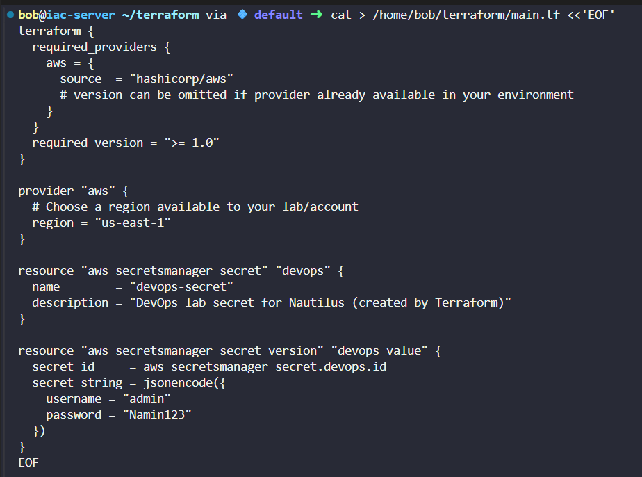
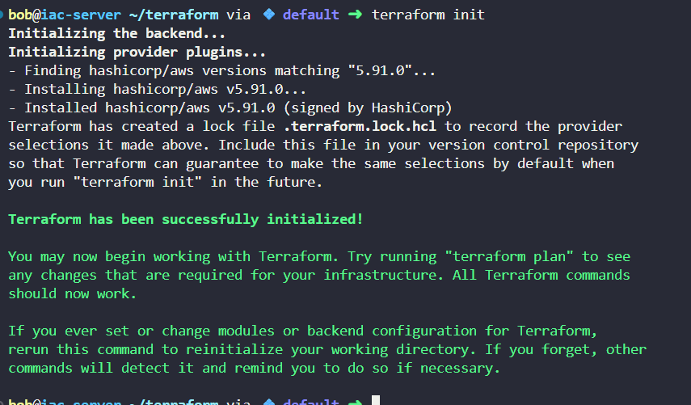
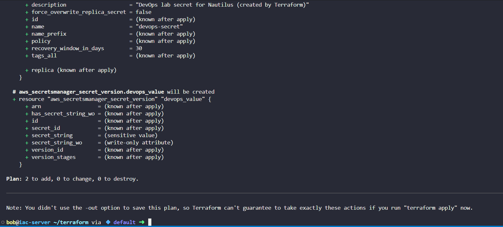
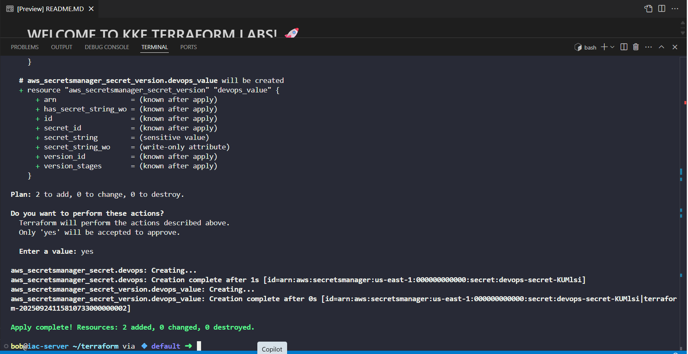

# Day 48: Secrets Management with Terraform

As part of my **100 Days of DevOps**, I focused on securely managing application credentials using **AWS Secrets Manager** and **Terraform**.

---

## Business Need
Organisations must store sensitive information (like database credentials or API keys) securely. Hard-coding them in configs or repos leads to **data breaches** and **compliance risks**.  

By leveraging **AWS Secrets Manager**, secrets are encrypted, rotated automatically, and centrally managed — ensuring both **security** and **operational efficiency**.

---

## Benefits
- **Security:** Prevents plain-text passwords in configs/repos.  

- **Repeatability:** Infrastructure as Code (IaC) with Terraform ensures secrets are consistently created across environments.  

- **Scalability:** Teams can scale without worrying about secret sprawl or manual updates.  

---

## Steps Taken
1. **Created `main.tf`** : defined `aws_secretsmanager_secret` (`devops-secret`) and `aws_secretsmanager_secret_version` with values:

   ```
   { "username": "admin", "password": "Namin123" }
   ```


**2. Initialised Terraform**

```
terraform init
terraform fmt
terraform validate
```


**3. Planned & Applied Infrastructure**
```
terraform plan
terraform apply -auto-approve
```



**4. Verified Secret Creation with AWS CLI:**
```
aws secretsmanager get-secret-value \
  --secret-id devops-secret \
  --query SecretString \
  --output text
```

Output:

```
{"username":"admin","password":"Namin123"}
```


## Key File
**main.tf**
```
terraform {
  required_providers {
    aws = {
      source  = "hashicorp/aws"
    }
  }
  required_version = ">= 1.0"
}

provider "aws" {
  region = "us-east-1"
}

resource "aws_secretsmanager_secret" "devops" {
  name        = "devops-secret"
  description = "DevOps lab secret for Nautilus (created by Terraform)"
}

resource "aws_secretsmanager_secret_version" "devops_value" {
  secret_id     = aws_secretsmanager_secret.devops.id
  secret_string = jsonencode({
    username = "admin"
    password = "Namin123"
  })
}
```
