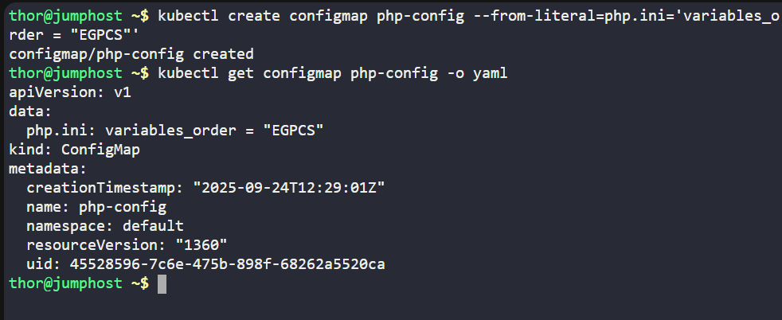
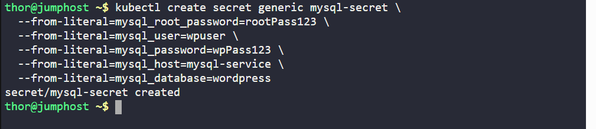
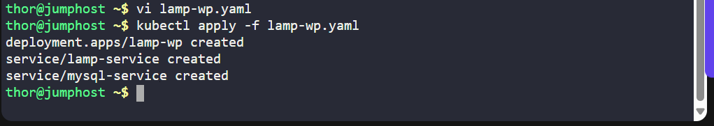
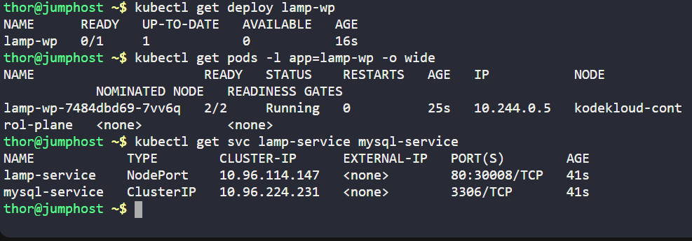
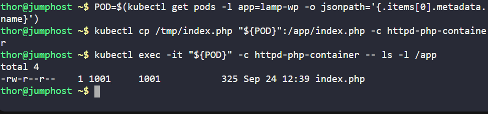
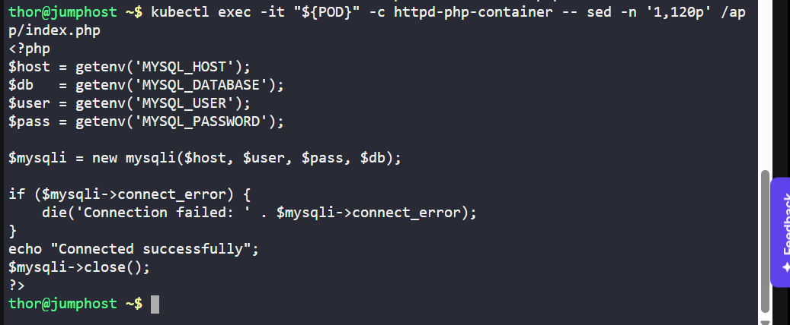
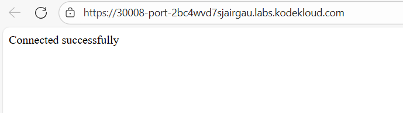

# Day 49 - Deploying a LAMP Stack on Kubernetes

As part of my **100 Days of DevOps (KodeKloud Labs)**, I deployed a **PHP website with Apache** and a **MySQL database** on a Kubernetes cluster.  

---

## Business Need
Companies running PHP applications often rely on the **LAMP stack (Linux, Apache, MySQL, PHP)**. Running this on Kubernetes provides:
- **Scalability**: applications can scale to handle traffic spikes.  
- **Security**: configs and credentials stored in ConfigMaps and Secrets, not hard-coded.  
- **Portability**: reproducible deployments across environments.  

---

## Benefits
- No credentials exposed in code (all stored as Kubernetes Secrets).  
- Flexible application deployment (PHP & MySQL as two containers in one pod).  
- External access via NodePort and internal DB connectivity via ClusterIP.  
- Demonstrates real-world DevOps practices (CI/CD friendly, IaC style).  

---

## Step-by-Step Commands

**1. Create the ConfigMap for PHP**
```
kubectl create configmap php-config \
  --from-literal=php.ini='variables_order = "EGPCS"'
````


**Verify:**
```
kubectl get configmap php-config -o yaml
```

**2. Create the Secret for MySQL**

```kubectl create secret generic mysql-secret \
  --from-literal=mysql_root_password=rootPass123 \
  --from-literal=mysql_user=wpuser \
  --from-literal=mysql_password=wpPass123 \
  --from-literal=mysql_host=mysql-service \
  --from-literal=mysql_database=wordpress
```

**Verify:**

```
kubectl get secret mysql-secret -o yaml
```


**3️. Create the Deployment + Services**
Save the following into lamp-wp.yaml:
-(Full manifest shown below in Key Files section)

**Apply it:**
```
kubectl apply -f lamp-wp.yaml
```
**Verify resources:**
```
kubectl get deploy lamp-wp
kubectl get pods -l app=lamp-wp -o wide
kubectl get svc lamp-service mysql-service
```



**4. Prepare and Copy index.php**

Create PHP file on jump_host:

```
cat > /tmp/index.php <<'EOF'
<?php
$host = getenv('MYSQL_HOST');
$db   = getenv('MYSQL_DATABASE');
$user = getenv('MYSQL_USER');
$pass = getenv('MYSQL_PASSWORD');

$mysqli = new mysqli($host, $user, $pass, $db);

if ($mysqli->connect_error) {
    die('Connection failed: ' . $mysqli->connect_error);
}
echo "Connected successfully";
$mysqli->close();
?>
EOF
```

**Get pod name:**
```
POD=$(kubectl get pods -l app=lamp-wp -o jsonpath='{.items[0].metadata.name}')
```

**Copy index.php into the Apache container:**
```
kubectl cp /tmp/index.php "${POD}":/app/index.php -c httpd-php-container
```

**Confirm:**

```
kubectl exec -it "${POD}" -c httpd-php-container -- ls -l /app
kubectl exec -it "${POD}" -c httpd-php-container -- head -20 /app/index.php
```



**5️. Test Application on Lab browser: Connected successfully**


## Key Files

**lamp-wp.yaml**

```
apiVersion: apps/v1
kind: Deployment
metadata:
  name: lamp-wp
spec:
  replicas: 1
  selector:
    matchLabels:
      app: lamp-wp
  template:
    metadata:
      labels:
        app: lamp-wp
    spec:
      containers:
      - name: httpd-php-container
        image: webdevops/php-apache:alpine-3-php7
        ports:
        - containerPort: 80
        env:
        - name: MYSQL_ROOT_PASSWORD
          valueFrom: { secretKeyRef: { name: mysql-secret, key: mysql_root_password } }
        - name: MYSQL_DATABASE
          valueFrom: { secretKeyRef: { name: mysql-secret, key: mysql_database } }
        - name: MYSQL_USER
          valueFrom: { secretKeyRef: { name: mysql-secret, key: mysql_user } }
        - name: MYSQL_PASSWORD
          valueFrom: { secretKeyRef: { name: mysql-secret, key: mysql_password } }
        - name: MYSQL_HOST
          valueFrom: { secretKeyRef: { name: mysql-secret, key: mysql_host } }
        volumeMounts:
        - name: php-config-volume
          mountPath: /opt/docker/etc/php/php.ini
          subPath: php.ini
        - name: app-volume
          mountPath: /app
      - name: mysql-container
        image: mysql:5.6
        ports:
        - containerPort: 3306
        env:
        - name: MYSQL_ROOT_PASSWORD
          valueFrom: { secretKeyRef: { name: mysql-secret, key: mysql_root_password } }
        - name: MYSQL_DATABASE
          valueFrom: { secretKeyRef: { name: mysql-secret, key: mysql_database } }
        - name: MYSQL_USER
          valueFrom: { secretKeyRef: { name: mysql-secret, key: mysql_user } }
        - name: MYSQL_PASSWORD
          valueFrom: { secretKeyRef: { name: mysql-secret, key: mysql_password } }
        - name: MYSQL_HOST
          valueFrom: { secretKeyRef: { name: mysql-secret, key: mysql_host } }
      volumes:
      - name: php-config-volume
        configMap:
          name: php-config
          items:
          - key: php.ini
            path: php.ini
      - name: app-volume
        emptyDir: {}
---
apiVersion: v1
kind: Service
metadata:
  name: lamp-service
spec:
  type: NodePort
  selector:
    app: lamp-wp
  ports:
  - port: 80
    targetPort: 80
    nodePort: 30008
---
apiVersion: v1
kind: Service
metadata:
  name: mysql-service
spec:
  selector:
    app: lamp-wp
  ports:
  - port: 3306
    targetPort: 3306
```
