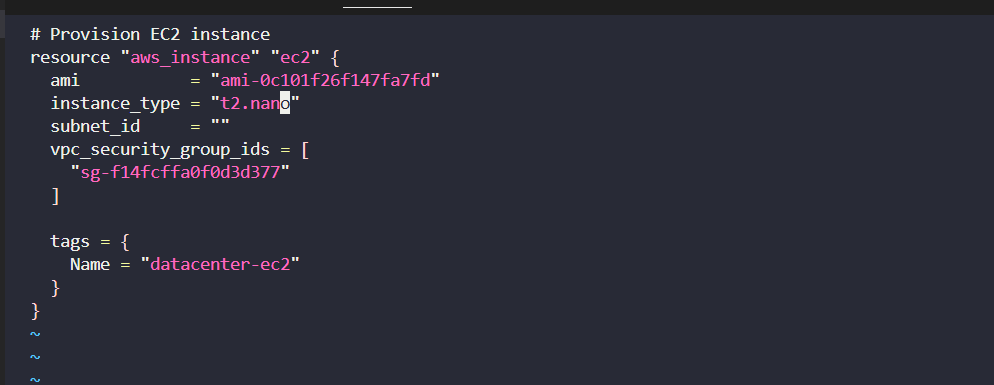

# Day 49: EC2 Right-Sizing via Terraform

**Objective:** Optimise cloud resource usage by resizing an underutilized EC2 instance (aws_instance.ec2) from t2.micro → t2.nano using Terraform, ensuring infrastructure is managed via IaC.

---

## Business Need:

Reduce cloud costs by right-sizing underutilized instances.

Maintain consistent, auditable infrastructure via Terraform.

Minimise downtime by validating instance state before applying changes.

## Project Benefit:

Demonstrates ability to manage AWS infrastructure programmatically.

Shows proficiency with Terraform, state management, and cloud cost optimization.

Ensures the team can scale resources up or down reliably without manual errors.

---

## Steps Taken

1️. **Initialise Terraform**

terraform init

-Ensures Terraform is ready with provider plugins.

**2️. Check existing EC2 instance**

terraform state list

terraform state show aws_instance.ec2 | grep instance_type

-Confirmed current instance type is t2.micro.


**3️. Edit main.tf to update instance type**

vi main.tf

**- Change:** instance_type = "t2.micro"

**To:**

**instance_type = "t2.nano"**


**4️. Format and validate configuration**

terraform fmt

terraform validate

**5️. Plan and Apply**

terraform apply 

-Terraform updated the EC2 instance type in-place.


**6️. Verify changes**
terraform state show aws_instance.ec2 | grep instance_type

-Confirms instance_type = "t2.nano".


## File Used

**main.tf**

```
resource "aws_instance" "ec2" {
  ami           = "ami-xxxxxx"
  instance_type = "t2.nano"
  tags = {
    Name = "datacenter-ec2"
  }
  # other attributes unchanged
}
```
