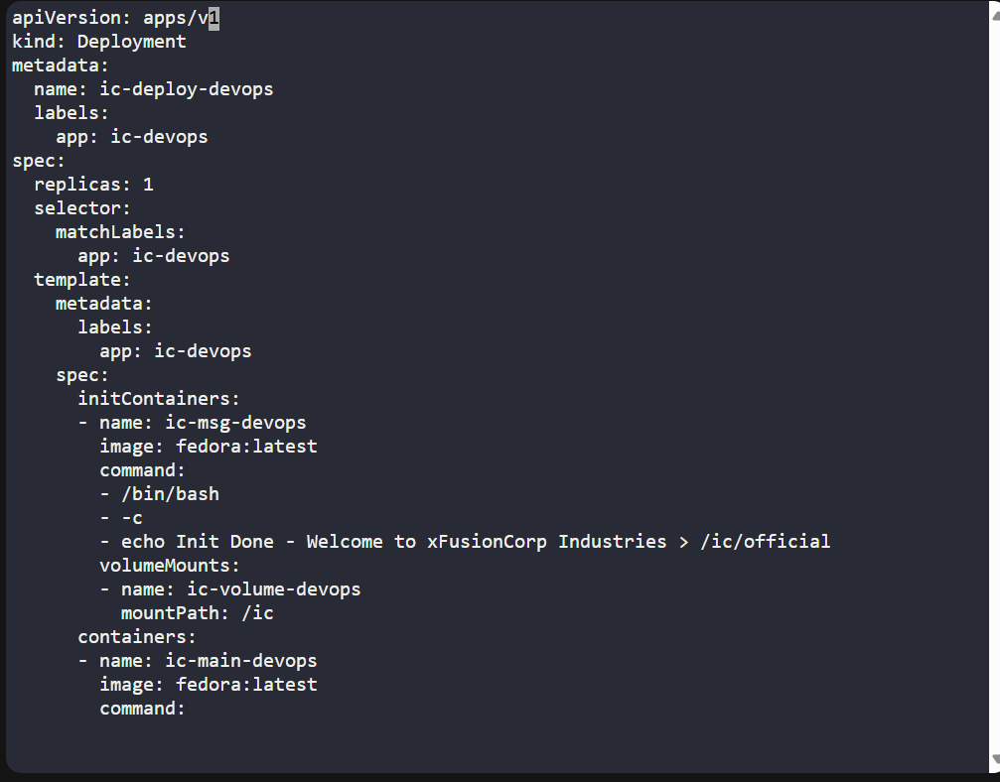
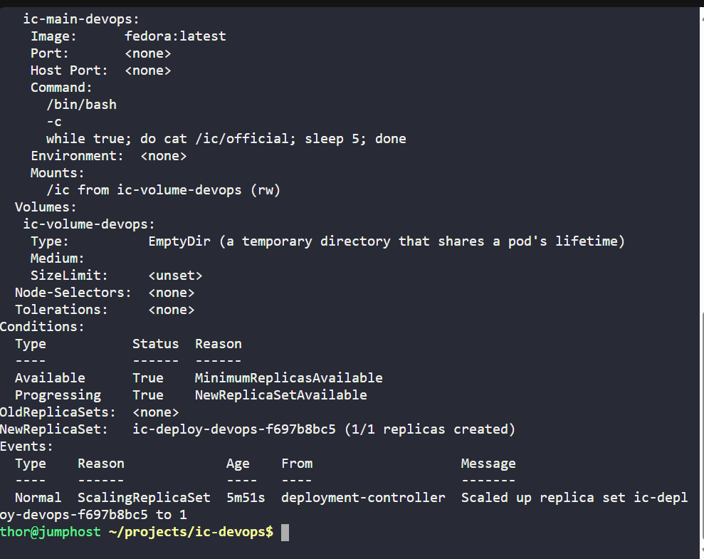
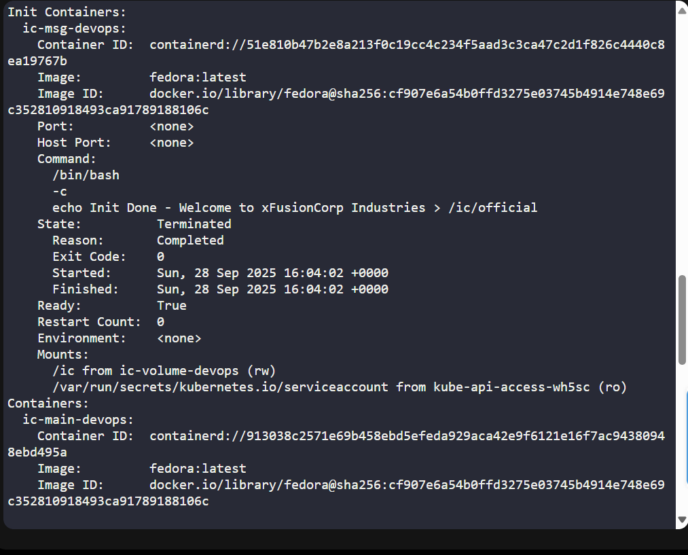
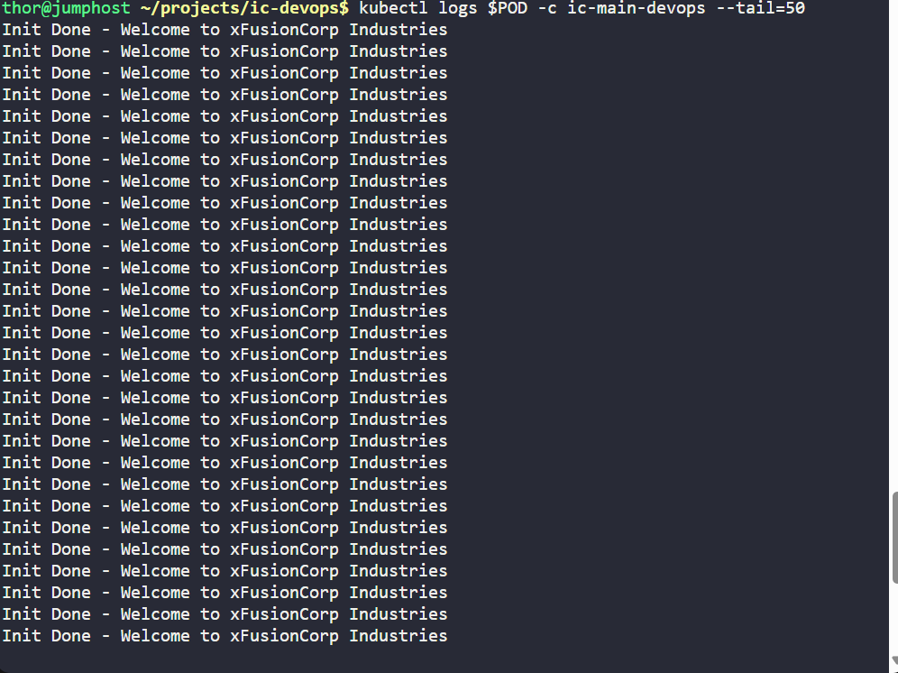
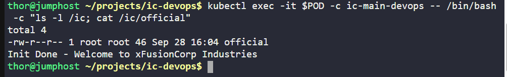

# Day 50 of 100 Days of DevOps: Kubernetes InitContainers

---

As part of my **100 Days of DevOps journey**, today I worked on a hands-on lab using **Kubernetes InitContainers**.  
This project was done in the **KodeKloud environment** and marks a milestone: **Day 50**.

---

## Business Context

Modern applications often require **pre-configuration tasks** (like writing config files, running scripts, or setting up shared volumes) **before the main application container can start**.  
Instead of baking these into the main image (which breaks reusability), **Kubernetes InitContainers** solve this problem:

- **Separation of concerns**: initialisation tasks are isolated.  
- **Reusable images**: app containers stay clean and lightweight.  
- **Reliability**: ensures the app only starts after pre-steps succeed.  

This pattern helps enterprises achieve **faster deployments**, **reliable startup sequences**, and **clearer CI/CD workflows**.

---

## Lab Task (Business Need → Technical Step)

1. **Create Deployment (`ic-deploy-devops`)**  
   - Business need: Manage application replicas with consistent configuration.  
   - Step: Used Kubernetes Deployment with label `app=ic-devops`.

2. **InitContainer (`ic-msg-devops`)**  
   - Business need: Pre-create a message/config file before app starts.  
   - Step: Wrote `"Init Done - Welcome to xFusionCorp Industries"` into `/ic/official`.

3. **Main Container (`ic-main-devops`)**  
   - Business need: Consume the config produced by init step.  
   - Step: Continuously read and print file contents from shared volume.

4. **Shared Volume (`emptyDir`)**  
   - Business need: Temporary storage shared between init and main containers.  
   - Step: Mounted `ic-volume-devops` at `/ic`.

---

## 🖼️ Suggested Screenshots

For GitHub repo and LinkedIn posts:

## Commands Used

```
mkdir -p ~/projects/ic-devops
cd ~/projects/ic-devops
```

**1. Create manifest**

```
vi ic-deploy-devops.yaml
```

**2. Apply deployment**

```
kubectl apply -f ic-deploy-devops.yaml
```

**3. Verify deployment**

```
kubectl get deploy ic-deploy-devops -o wide
kubectl describe deploy ic-deploy-devops
```


**4. Check pod**

```
kubectl get pods -l app=ic-devops
POD=$(kubectl get pods -l app=ic-devops -o jsonpath='{.items[0].metadata.name}')
```

**5. Inspect pod details**

```
kubectl describe pod $POD
```

**6. Logs from init container**

```
kubectl logs $POD -c ic-msg-devops
```

**7. Logs from main container**

```
kubectl logs $POD -c ic-main-devops --tail=20
```

**8. Verify file inside main container**

```
kubectl exec -it $POD -c ic-main-devops -- /bin/bash -c "ls -l /ic; cat /ic/official"
```

## Manifest File
ic-deploy-devops.yaml:

```
apiVersion: apps/v1
kind: Deployment
metadata:
  name: ic-deploy-devops
  labels:
    app: ic-devops
spec:
  replicas: 1
  selector:
    matchLabels:
      app: ic-devops
  template:
    metadata:
      labels:
        app: ic-devops
    spec:
      initContainers:
      - name: ic-msg-devops
        image: fedora:latest
        command:
        - /bin/bash
        - -c
        - echo Init Done - Welcome to xFusionCorp Industries > /ic/official
        volumeMounts:
        - name: ic-volume-devops
          mountPath: /ic
      containers:
      - name: ic-main-devops
        image: fedora:latest
        command:
        - /bin/bash
        - -c
        - while true; do cat /ic/official; sleep 5; done
        volumeMounts:
        - name: ic-volume-devops
          mountPath: /ic
      volumes:
      - name: ic-volume-devops
        emptyDir: {}
```

---

## Key Takeaway
This exercise demonstrates how InitContainers can solve real-world DevOps challenges by preparing environments before main apps run.
This ensures predictability, cleaner images, and faster troubleshooting — exactly what businesses need in production Kubernetes clusters.

---
