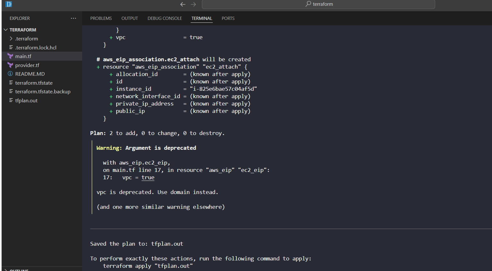
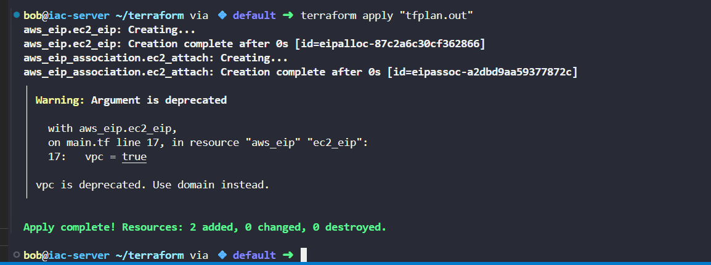

# Day 50 of 100DaysOfDevOps: Attaching Elastic IP to EC2 with Terraform
As part of the Nautilus migration strategy, today’s lab focused on binding an Elastic IP (EIP) to an EC2 instance using Terraform.

## Business Need

---

For enterprises migrating to AWS, static IPs (Elastic IPs) are critical for:

-Ensuring reliable DNS mapping

-Supporting disaster recovery and failover

-Allowing stable client connections even when instances are recreated

-Without this, applications risk downtime due to changing public IPs.

---

## What I Did

---

-Provisioned EC2 – Defined an AWS instance in main.tf with proper networking & security group.

-Created an Elastic IP – Used Terraform to allocate a static IP.

-Associated Elastic IP – Ensured the EC2 instance had a permanent, publicly routable address.

-Validated – Confirmed EIP attachment with aws ec2 describe-addresses.

---

**main.tf**

```
# Configure the AWS Provider
provider "aws" {
  region = "us-east-1"
}

# Provision EC2 instance
resource "aws_instance" "ec2" {
  ami           = "ami-0c101f26f147fa7fd"
  instance_type = "t2.micro"
  subnet_id     = "subnet-752e053dfd4dc4a18"
  vpc_security_group_ids = [
    "sg-33bfaf6151e3a4f30"
  ]

  tags = {
    Name = "datacenter-ec2"
  }
}

# Provision Elastic IP
resource "aws_eip" "ec2_eip" {
  vpc = true
  tags = {
    Name = "datacenter-ec2-eip"
  }
}

# Attach the Elastic IP to the EC2 instance
resource "aws_eip_association" "ec2_attach" {
  instance_id   = aws_instance.ec2.id
  allocation_id = aws_eip.ec2_eip.id
}
```

## Commands I Used

**1. Initialise Terraform**
```
terraform init
```

**2. Format & validate**

```
terraform fmt
terraform validate
```

**3. Plan and apply changes**

```
terraform plan -out=tfplan.out
terraform apply "tfplan.out"
```



**4. Confirm Elastic IP association**

```
aws ec2 describe-addresses --region us-east-1 \
  --query "Addresses[*].{PublicIp:PublicIp,AllocationId:AllocationId,Tags:Tags}" --output table
```

## Benefit
This lab showed how to codify networking dependencies in Terraform, ensuring AWS resources remain consistent, reliable, and production-ready.
