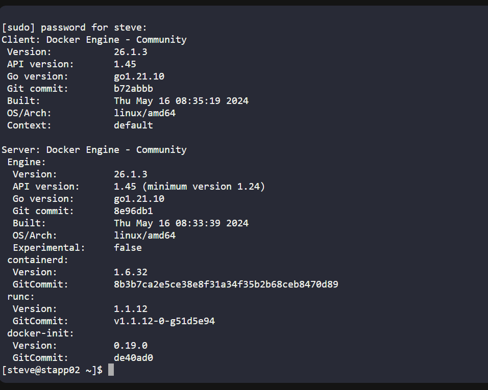
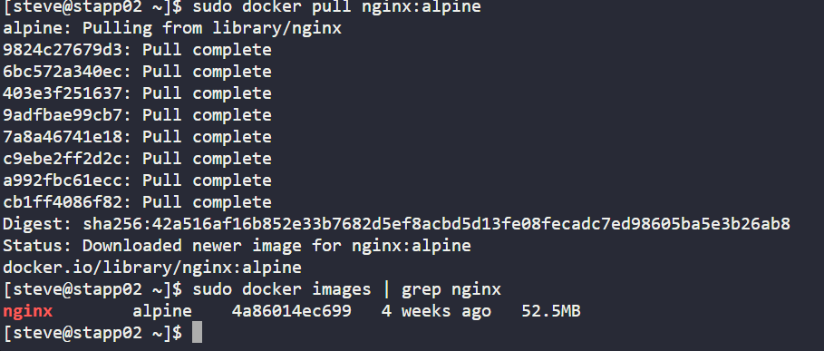
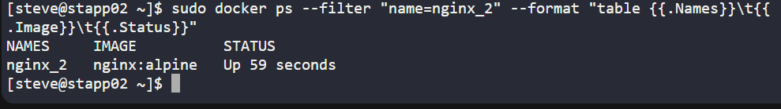

# Day 36 - Deploying an Nginx Container on Application Server 1 (KodeKloud Lab)
As part of my 100 Days of DevOps journey on KodeKloud, I worked on a practical deployment task:

Running an Nginx container on Application Server 1 using the nginx:alpine image.

## Business Need & Essence of the Task
In modern organisations, containerisation is a cornerstone of DevOps and Cloud Engineering. Businesses need:

-Fast deployments → Containers allow rapid startup and portability across environments.

-Lightweight footprint → Using nginx:alpine ensures minimal resource usage while serving production workloads.

-Consistency → Running the same image across dev, test, and production environments ensures predictable behavior.

This task simulates a real-world scenario where an Ops/DevOps engineer must spin up a containerized web service on a specific application server.

## Steps I Performed (on KodeKloud CentOS Environment)
1. Accessing Application Server 1

I connected to Application Server 1 via the provided KodeKloud environment and verified my session.

2️. Checking Docker Setup

I ensured that Docker was installed and active. This is essential for container management.

3️. Pulling the Nginx Alpine Image

I pulled the lightweight Nginx image (nginx:alpine) from Docker Hub.

**Using Alpine ensures a small, efficient, and secure base image.**

4. Running the Container

I launched the container named nginx_1 in detached mode:

sudo docker run -d --name nginx_1 nginx:alpine

-Detached mode ensures the container runs in the background.

-Assigning a meaningful name (nginx_1) helps manage containers easily in production.

5️. Verifying Container Status

Finally, I confirmed the container was up and running with:

sudo docker ps

This validated that the service was correctly deployed.

## Key Learnings & Benefits

-Practical experience with Docker basics → running, naming, and managing containers.

-Real-world DevOps value → Deploying Nginx, a commonly used web server, mirrors real enterprise use cases.

-Business impact → This skill demonstrates the ability to quickly provision lightweight, reliable services, critical for scalability and uptime in production environments.
